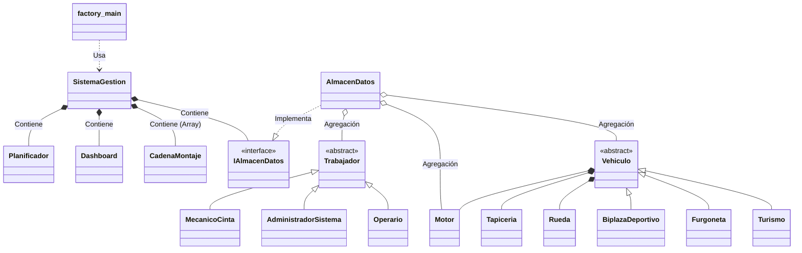

# Práctica de Programación Orientada a Objetos – Curso 2025-2026

**Alumno:** Sergio Cuadrado Hernández  
**Correo electrónico:** [Tu correo de la UNED]  
**Teléfono de contacto:** [Tu número de teléfono]

---

## 1. Análisis de la Aplicación y Decisiones de Diseño

### 1.1. Funcionamiento General
La aplicación simula el funcionamiento completo de una fábrica de vehículos. Permite gestionar el stock de componentes en un almacén (motores, ruedas, tapicerías), dar de alta a distintos tipos de trabajadores (operarios, mecánicos, gestores) y configurar tres cadenas de montaje simultáneas. Una vez configurado el entorno, el sistema lanza una simulación paso a paso (basada en el paso de los "segundos") donde los vehículos se ensamblan estación por estación.

### 1.2. Decisiones de Diseño y Estrategias Implementadas
Para la construcción de la aplicación, se ha optado por un diseño modular basado en los principios de la Programación Orientada a Objetos:

*   **Arquitectura en Capas (Fachada):** Se ha diseñado una clase central `SistemaGestion` que actúa como "Fachada" (Facade Pattern). Esta clase oculta la complejidad del subsistema y proporciona una interfaz simplificada para que el programa principal (`factory_main`) interactúe con la lógica de negocio sin conocer sus entresijos.
*   **Abstracción y Desacoplamiento (Interfaces):** Se ha implementado la interfaz `IAlmacenDatos` para gestionar el repositorio de información, y la interfaz `IVisualizador` para la salida de datos del Dashboard. **Justificación:** Esto permite que, en el futuro, se pueda sustituir el almacenamiento en memoria por una Base de Datos, o la salida por consola por una Interfaz Gráfica (GUI) sin modificar la lógica principal de la simulación.
*   **Polimorfismo y Herencia:** Se ha utilizado una jerarquía de clases robusta para las familias de objetos del dominio:
    *   **Componentes:** Clases abstractas `Motor`, `Tapiceria`, `Rueda` con sus respectivas implementaciones concretas.
    *   **Vehículos:** Clase base abstracta `Vehiculo` especializándose en `Turismo`, `BiplazaDeportivo` y `Furgoneta`.
    *   **Trabajadores:** Clase abstracta `Trabajador` de la que heredan los distintos perfiles (`Operario`, `MecanicoCinta`, etc.). **Justificación:** Esto permite manejar colecciones genéricas de componentes o trabajadores de forma unificada, aprovechando la resolución dinámica de métodos y evitando el uso abusivo de sentencias condicionales (`instanceof`).
*   **Simulación controlada por eventos de tiempo (Ticks):** El `Planificador` gobierna el avance de la simulación ejecutando un bucle que representa cada "segundo" del sistema. Evalúa las paradas, averías y tiempos de montaje, asegurando sincronización y evitando bucles infinitos no deseados.

---

## 2. Diagrama de Clases

A continuación se muestra el esquema simplificado de relaciones estructurales de la aplicación:



**Explicación de relaciones:**
*   **Herencia (`<|--`):** Las clases específicas heredan de clases abstractas genéricas (ej. `Turismo` hereda de `Vehiculo`).
*   **Implementación (`..|>`):** `AlmacenDatos` implementa el contrato dictado por `IAlmacenDatos`.
*   **Composición (`*--`):** Un `Vehiculo` no tiene sentido sin sus componentes fundamentales, los crea y destruye con su ciclo de vida.
*   **Agregación (`o--`):** El `AlmacenDatos` guarda colecciones de `Trabajador` y componentes, que existen de forma independiente al almacén.

---

## 3. Descripción de Clases

A continuación se detalla la finalidad de cada clase y sus métodos más representativos:

### 3.1. Núcleo y Control
*   **`factory_main`:**
    *   *Justificación:* Punto de entrada a la aplicación (Main). Separa la entrada/salida de menús interactivos de la lógica interna.
    *   *Métodos públicos:* `main(String[] args)`.
*   **`SistemaGestion`:**
    *   *Justificación:* Fachada principal. Encapsula y coordina la relación entre el almacén, cadenas y simulación.
    *   *Funcionalidad:* Recibe órdenes de la vista, crea objetos concretos y los inserta en el almacén.
    *   *Métodos públicos:* `addMotores()`, `altaOperario()`, `configurarCadena()`, `iniciarSimulacion()`, `listarTrabajadores()`.
*   **`Planificador`:**
    *   *Justificación:* Motor de la simulación. Actúa como el "reloj" de la fábrica.
    *   *Funcionalidad:* Gestiona las averías aleatorias, controla las paradas por tiempo de montaje y mueve el estado de cada vehículo.
    *   *Métodos públicos:* `ejecutarSimulacion(TipoSimulacion tipo)`.

### 3.2. Gestión de Datos
*   **`IAlmacenDatos` (Interfaz) y `AlmacenDatos`:**
    *   *Justificación:* Repositorio centralizado (Base de Datos en memoria) de todos los objetos instanciados.
    *   *Funcionalidad:* Guarda y recupera stock de piezas, vehículos completados, trabajadores y registros históricos.
    *   *Métodos públicos:* `addMotor()`, `retirarMotor()`, `buscarTrabajadores()`, `addRegistroMontaje()`.

### 3.3. Producción
*   **`CadenaMontaje`:**
    *   *Justificación:* Mantiene el estado operativo de una línea de ensamblaje concreta.
    *   *Funcionalidad:* Define el tipo de coche a producir, controla las 4 estaciones de montaje y guarda las variables de pausa y operarios asignados.
    *   *Métodos públicos:* `configurar()`, `asignarOperarios()`, `decrementarParada()`, `crearNuevoVehiculo()`.
*   **`RegistroMontaje`:**
    *   *Justificación:* Inmutabilidad del histórico. Permite generar informes retrospectivos.
    *   *Funcionalidad:* Almacena información puntual de cada avance en las estaciones.

### 3.4. Componentes y Vehículos
*   **`Vehiculo` (y subclases `Turismo`, `BiplazaDeportivo`, `Furgoneta`):**
    *   *Justificación:* Representan el producto fabricado. Su abstracción permite que la cadena trabaje con cualquier modelo sin importar su tamaño o MMA.
    *   *Métodos públicos:* `setMotor()`, `setRuedas()`, `getEstado()`, `avanzarEstado()`.
*   **Componentes (`Motor`, `Tapiceria`, `Rueda` y subclases):**
    *   *Justificación:* Abstraen las características físicas de los elementos. Por ejemplo, `MotorHibrido` o `RuedaDeportiva`.
    *   *Métodos públicos:* Diferentes Getters como `getPotencia()`, `getTipo()`, `getMetrosCuadrados()`.

### 3.5. Entidades de Trabajo
*   **`Trabajador` (y subclases `Operario`, `MecanicoCinta`, `AdministradorSistema`, `GestorPlanta`):**
    *   *Justificación:* Gestión de Recursos Humanos y perfiles de actividad en la simulación.
    *   *Funcionalidad:* Cada perfil aporta atributos específicos (ej. el operario tiene `tiempoMontaje` y eficiencia, el mecánico tiene `repararCinta()`).
    *   *Métodos públicos:* `getPerfil()`, `isEficiente()`, `restaurarTodo()`.

### 3.6. Visualización y Estados
*   **`Dashboard`, `IVisualizador`, `VisualizadorConsola`:**
    *   *Justificación:* Mecanismo de impresión de estado por pantalla en tiempo real (separación Vista-Controlador).
    *   *Métodos públicos:* `actualizar()`, `mostrarEstadoCadenas()`, `notificarError()`.
*   **Enumerados (`EstadoVehiculo`, `TipoSimulacion`):**
    *   *Justificación:* Restringen y garantizan tipos seguros de datos limitados (ej. `PENDIENTE`, `CHASIS`, `COMPLETADO`).

---

## 5. Anexo: Código Fuente

A continuación se adjunta el código fuente íntegro de todas las clases desarrolladas.


### AdministradorSistema.java

```java
/**
 * Administrador del sistema: vela por el correcto funcionamiento
 * del software de la fábrica. Cuando se produce un apagón,
 * necesita 2 segundos para restaurar el sistema de gestión
 * y 3 segundos para restaurar las cadenas de montaje.
 * 
 * @author Sergio Cuadrado Hernández

 */
public class AdministradorSistema extends Trabajador
{
    private static final int TIEMPO_RESTAURAR_GESTION = 2;
    private static final int TIEMPO_RESTAURAR_CADENAS = 3;

    public AdministradorSistema(String nombre, String apellidos, String dni,
                                 String direccion, String numSeguridadSocial,
                                 double salario, String fechaIngreso)
    {
        super(nombre, apellidos, dni, direccion, numSeguridadSocial,
              "Administrador del Sistema", salario, fechaIngreso);
    }

    public int restaurarSistemaGestion()
    {
        System.out.println("  [ADMIN] Restaurando sistema de gestión... (" 
                           + TIEMPO_RESTAURAR_GESTION + "s)");
        return TIEMPO_RESTAURAR_GESTION;
    }

    public int restaurarCadenasMontaje()
    {
        System.out.println("  [ADMIN] Restaurando cadenas de montaje... (" 
                           + TIEMPO_RESTAURAR_CADENAS + "s)");
        return TIEMPO_RESTAURAR_CADENAS;
    }

    public int restaurarTodo()
    {
        return restaurarSistemaGestion() + restaurarCadenasMontaje();
    }

    public String getPerfil()
    {
        return "Administrador del Sistema";
    }
}


```


### AlmacenDatos.java

```java
import java.util.ArrayList;

/**
 * Implementación del almacén de datos en memoria.
 * Implementa la interfaz IAlmacenDatos para mantener el diseño desacoplado.
 * Se puede sustituir por otra implementación (ficheros, BBDD, etc.)
 * sin modificar el resto del sistema.
 * 
 * @author Sergio Cuadrado Hernández

 */
public class AlmacenDatos implements IAlmacenDatos
{
    private ArrayList<Motor> motores;
    private ArrayList<Tapiceria> tapicerias;
    private ArrayList<Rueda> ruedas;
    private ArrayList<Vehiculo> vehiculos;
    private ArrayList<Trabajador> trabajadores;
    private ArrayList<RegistroMontaje> registros;

    public AlmacenDatos()
    {
        motores = new ArrayList<Motor>();
        tapicerias = new ArrayList<Tapiceria>();
        ruedas = new ArrayList<Rueda>();
        vehiculos = new ArrayList<Vehiculo>();
        trabajadores = new ArrayList<Trabajador>();
        registros = new ArrayList<RegistroMontaje>();
    }

    // ========== GESTIÓN DE MOTORES ==========

    public void addMotor(Motor motor)
    {
        motores.add(motor);
    }

    public Motor getMotor(int index)
    {
        if (index >= 0 && index < motores.size()) {
            return motores.get(index);
        }
        return null;
    }

    public ArrayList<Motor> getMotores()
    {
        return motores;
    }

    public int getStockMotores()
    {
        return motores.size();
    }

    public Motor retirarMotor(String tipo)
    {
        for (int i = 0; i < motores.size(); i++) {
            if (motores.get(i).getTipo().equals(tipo)) {
                return motores.remove(i);
            }
        }
        return null;
    }

    // ========== GESTIÓN DE TAPICERÍA ==========

    public void addTapiceria(Tapiceria tapiceria)
    {
        tapicerias.add(tapiceria);
    }

    public Tapiceria getTapiceria(int index)
    {
        if (index >= 0 && index < tapicerias.size()) {
            return tapicerias.get(index);
        }
        return null;
    }

    public ArrayList<Tapiceria> getTapicerias()
    {
        return tapicerias;
    }

    public int getStockTapicerias()
    {
        return tapicerias.size();
    }

    public Tapiceria retirarTapiceria(String tipo)
    {
        for (int i = 0; i < tapicerias.size(); i++) {
            if (tapicerias.get(i).getTipo().equals(tipo)) {
                return tapicerias.remove(i);
            }
        }
        return null;
    }

    // ========== GESTIÓN DE RUEDAS ==========

    public void addRueda(Rueda rueda)
    {
        ruedas.add(rueda);
    }

    public Rueda getRueda(int index)
    {
        if (index >= 0 && index < ruedas.size()) {
            return ruedas.get(index);
        }
        return null;
    }

    public ArrayList<Rueda> getRuedas()
    {
        return ruedas;
    }

    public int getStockRuedas()
    {
        return ruedas.size();
    }

    public Rueda retirarRueda(String tipo)
    {
        for (int i = 0; i < ruedas.size(); i++) {
            if (ruedas.get(i).getTipo().equals(tipo)) {
                return ruedas.remove(i);
            }
        }
        return null;
    }

    public int contarRuedasPorTipo(String tipo)
    {
        int count = 0;
        for (Rueda r : ruedas) {
            if (r.getTipo().equals(tipo)) {
                count++;
            }
        }
        return count;
    }

    public int contarMotoresPorTipo(String tipo)
    {
        int count = 0;
        for (Motor m : motores) {
            if (m.getTipo().equals(tipo)) {
                count++;
            }
        }
        return count;
    }

    public int contarTapiceriasPorTipo(String tipo)
    {
        int count = 0;
        for (Tapiceria t : tapicerias) {
            if (t.getTipo().equals(tipo)) {
                count++;
            }
        }
        return count;
    }

    // ========== GESTIÓN DE VEHÍCULOS ==========

    public void addVehiculo(Vehiculo vehiculo)
    {
        vehiculos.add(vehiculo);
    }

    public Vehiculo getVehiculo(int index)
    {
        if (index >= 0 && index < vehiculos.size()) {
            return vehiculos.get(index);
        }
        return null;
    }

    public ArrayList<Vehiculo> getVehiculos()
    {
        return vehiculos;
    }

    public int getTotalVehiculos()
    {
        return vehiculos.size();
    }

    // ========== GESTIÓN DE TRABAJADORES ==========

    public void addTrabajador(Trabajador trabajador)
    {
        trabajadores.add(trabajador);
    }

    public Trabajador getTrabajadorPorDni(String dni)
    {
        for (Trabajador t : trabajadores) {
            if (t.getDni().equals(dni)) {
                return t;
            }
        }
        return null;
    }

    public ArrayList<Trabajador> getTrabajadores()
    {
        return trabajadores;
    }

    public ArrayList<Operario> getOperarios()
    {
        ArrayList<Operario> ops = new ArrayList<Operario>();
        for (Trabajador t : trabajadores) {
            if (t instanceof Operario) {
                ops.add((Operario) t);
            }
        }
        return ops;
    }

    public ArrayList<MecanicoCinta> getMecanicos()
    {
        ArrayList<MecanicoCinta> mecs = new ArrayList<MecanicoCinta>();
        for (Trabajador t : trabajadores) {
            if (t instanceof MecanicoCinta) {
                mecs.add((MecanicoCinta) t);
            }
        }
        return mecs;
    }

    public AdministradorSistema getAdministrador()
    {
        for (Trabajador t : trabajadores) {
            if (t instanceof AdministradorSistema) {
                return (AdministradorSistema) t;
            }
        }
        return null;
    }

    public GestorPlanta getGestorPlanta()
    {
        for (Trabajador t : trabajadores) {
            if (t instanceof GestorPlanta) {
                return (GestorPlanta) t;
            }
        }
        return null;
    }

    public void removeTrabajador(String dni)
    {
        for (int i = 0; i < trabajadores.size(); i++) {
            if (trabajadores.get(i).getDni().equals(dni)) {
                trabajadores.remove(i);
                return;
            }
        }
    }

    public ArrayList<Trabajador> buscarTrabajadores(String texto)
    {
        ArrayList<Trabajador> resultado = new ArrayList<Trabajador>();
        String textoBusqueda = texto.toLowerCase();
        for (Trabajador t : trabajadores) {
            if (t.getNombre().toLowerCase().contains(textoBusqueda) ||
                t.getApellidos().toLowerCase().contains(textoBusqueda) ||
                t.getDni().toLowerCase().contains(textoBusqueda)) {
                resultado.add(t);
            }
        }
        return resultado;
    }

    // ========== REGISTROS DE MONTAJE ==========

    public void addRegistroMontaje(RegistroMontaje registro)
    {
        registros.add(registro);
    }

    public ArrayList<RegistroMontaje> getRegistrosPorFecha(String fecha)
    {
        ArrayList<RegistroMontaje> resultado = new ArrayList<RegistroMontaje>();
        for (RegistroMontaje r : registros) {
            if (r.getFecha().equals(fecha)) {
                resultado.add(r);
            }
        }
        return resultado;
    }

    public ArrayList<RegistroMontaje> getTodosRegistros()
    {
        return registros;
    }
}

```


### BiplazaDeportivo.java

```java
/**
 * Vehículo biplaza deportivo. Tiene 2 plazas por defecto.
 * 
 * @author Sergio Cuadrado Hernández

 */
public class BiplazaDeportivo extends Vehiculo
{
    public BiplazaDeportivo(String color, double tara, double pesoMaxAutorizado)
    {
        super(color, 2, tara, pesoMaxAutorizado);
    }

    public String getTipo()
    {
        return "Biplaza Deportivo";
    }
}

```


### CadenaMontaje.java

```java
import java.util.ArrayList;

/**
 * Cadena de montaje que ensambla vehículos paso a paso.
 * Cada cadena tiene 4 estaciones: Chasis, Motor, Tapicería, Ruedas.
 * Cada estación tiene un robot controlado por un operario.
 * 
 * @author Sergio Cuadrado Hernández

 */
public class CadenaMontaje
{
    private int numero;                  // número de cadena (1, 2 o 3)
    private boolean activa;
    private boolean averiada;
    private int tiempoParada;            // segundos restantes de parada
    
    // Configuración de producción
    private int tipoVehiculo;            // 1=Biplaza, 2=Turismo, 3=Furgoneta
    private int tipoMotor;               // 1=Eléctrico, 2=Gasolina, 3=Híbrido
    private int tipoTapiceria;           // 1=Tela, 2=Cuero, 3=Alcántara
    private int tipoRueda;               // 1=Normal, 2=Deportiva, 3=Todoterreno
    private int unidadesPendientes;
    private int unidadesCompletadas;
    
    // Vehículo en proceso de montaje
    private Vehiculo vehiculoActual;
    
    // Operarios asignados (4 estaciones)
    private Operario[] operarios;
    
    // Problemas reparados en esta simulación
    private int problemasReparados;

    public CadenaMontaje(int numero)
    {
        this.numero = numero;
        this.activa = false;
        this.averiada = false;
        this.tiempoParada = 0;
        this.tipoVehiculo = 0;
        this.tipoMotor = 0;
        this.tipoTapiceria = 0;
        this.tipoRueda = 0;
        this.unidadesPendientes = 0;
        this.unidadesCompletadas = 0;
        this.vehiculoActual = null;
        this.operarios = new Operario[4];
        this.problemasReparados = 0;
    }

    public void configurar(int tipoVehiculo, int tipoMotor, int tipoTapiceria,
                            int tipoRueda, int unidades)
    {
        this.tipoVehiculo = tipoVehiculo;
        this.tipoMotor = tipoMotor;
        this.tipoTapiceria = tipoTapiceria;
        this.tipoRueda = tipoRueda;
        this.unidadesPendientes = unidades;
        this.unidadesCompletadas = 0;
        this.activa = true;
        this.vehiculoActual = null;
        this.problemasReparados = 0;
    }

    public void asignarOperarios(Operario[] ops)
    {
        for (int i = 0; i < 4 && i < ops.length; i++) {
            this.operarios[i] = ops[i];
        }
    }

    public Vehiculo crearNuevoVehiculo()
    {
        String[] colores = {"Rojo", "Azul", "Negro", "Blanco", "Gris", "Plata"};
        String color = colores[(int)(Math.random() * colores.length)];
        
        switch (tipoVehiculo) {
            case 1: return new BiplazaDeportivo(color, 1200, 1600);
            case 2: return new Turismo(color, 5, 1400, 2000);
            case 3: return new Furgoneta(color, 3, 1800, 3500);
            default: return new Turismo(color, 5, 1400, 2000);
        }
    }

    public String getNombreTipoMotor()
    {
        switch (tipoMotor) {
            case 1: return "Eléctrico";
            case 2: return "Gasolina";
            case 3: return "Híbrido";
            default: return "Desconocido";
        }
    }

    public String getNombreTipoTapiceria()
    {
        switch (tipoTapiceria) {
            case 1: return "Tela";
            case 2: return "Cuero";
            case 3: return "Alcántara";
            default: return "Desconocido";
        }
    }

    public String getNombreTipoRueda()
    {
        switch (tipoRueda) {
            case 1: return "Normal";
            case 2: return "Deportiva";
            case 3: return "Todoterreno";
            default: return "Desconocido";
        }
    }

    public String getNombreTipoVehiculo()
    {
        switch (tipoVehiculo) {
            case 1: return "Biplaza Deportivo";
            case 2: return "Turismo";
            case 3: return "Furgoneta";
            default: return "Desconocido";
        }
    }

    // ---- Getters y Setters ----
    public int getNumero() { return numero; }
    public boolean isActiva() { return activa; }
    public void setActiva(boolean activa) { this.activa = activa; }
    public boolean isAveriada() { return averiada; }
    public void setAveriada(boolean averiada) { this.averiada = averiada; }
    public int getTiempoParada() { return tiempoParada; }
    public void setTiempoParada(int t) { this.tiempoParada = t; }
    public Vehiculo getVehiculoActual() { return vehiculoActual; }
    public void setVehiculoActual(Vehiculo v) { this.vehiculoActual = v; }
    public int getUnidadesPendientes() { return unidadesPendientes; }
    public void setUnidadesPendientes(int u) { this.unidadesPendientes = u; }
    public int getUnidadesCompletadas() { return unidadesCompletadas; }
    public void setUnidadesCompletadas(int u) { this.unidadesCompletadas = u; }
    public Operario[] getOperarios() { return operarios; }
    public int getTipoVehiculo() { return tipoVehiculo; }
    public int getTipoMotor() { return tipoMotor; }
    public int getTipoTapiceria() { return tipoTapiceria; }
    public int getTipoRueda() { return tipoRueda; }
    public int getProblemasReparados() { return problemasReparados; }
    public void incrementarProblemas() { problemasReparados++; }

    public boolean tieneTrabajoPendiente()
    {
        return unidadesPendientes > 0 || vehiculoActual != null;
    }

    public void decrementarParada()
    {
        if (tiempoParada > 0) {
            tiempoParada--;
            if (tiempoParada == 0) {
                averiada = false;
            }
        }
    }

    public String toString()
    {
        StringBuilder sb = new StringBuilder();
        sb.append("Cadena ").append(numero);
        sb.append(activa ? " [ACTIVA]" : " [INACTIVA]");
        if (averiada) sb.append(" [AVERIADA - Parada: ").append(tiempoParada).append("s]");
        sb.append(" | Vehículo: ").append(getNombreTipoVehiculo());
        sb.append(" | Pendientes: ").append(unidadesPendientes);
        sb.append(" | Completados: ").append(unidadesCompletadas);
        if (vehiculoActual != null) {
            sb.append(" | En curso: ").append(vehiculoActual.getEstado().getDescripcion());
        }
        return sb.toString();
    }
}

```


### Dashboard.java

```java
/**
 * Dashboard (cuadro de mandos) de la fábrica.
 * Muestra el balance de componentes en el almacén y el estado
 * de los vehículos en las cadenas de montaje.
 * 
 * Diseño desacoplado: usa IVisualizador para permitir cambiar
 * el subsistema de visualización sin modificar esta clase.
 * 
 * @author Sergio Cuadrado Hernández

 */
public class Dashboard
{
    private IVisualizador visualizador;
    private CadenaMontaje[] cadenas;
    private IAlmacenDatos almacen;

    public Dashboard(IVisualizador visualizador, CadenaMontaje[] cadenas, 
                     IAlmacenDatos almacen)
    {
        this.visualizador = visualizador;
        this.cadenas = cadenas;
        this.almacen = almacen;
    }

    public void actualizar()
    {
        visualizador.mostrarDashboard(cadenas, almacen);
    }

    public void mostrarCadenas()
    {
        visualizador.mostrarEstadoCadenas(cadenas);
    }

    public void mostrarAlmacen()
    {
        visualizador.mostrarEstadoAlmacen(almacen);
    }

    public void notificar(String mensaje)
    {
        visualizador.mostrarMensaje(mensaje);
    }

    public void notificarError(String error)
    {
        visualizador.mostrarError(error);
    }

    public void setVisualizador(IVisualizador nuevoVisualizador)
    {
        this.visualizador = nuevoVisualizador;
    }

    public IVisualizador getVisualizador()
    {
        return visualizador;
    }
}

```


### EstadoVehiculo.java

```java
/**
 * Enumeración que representa los estados posibles de un vehículo
 * durante el proceso de montaje en la cadena de montaje.
 * 
 * @author Sergio Cuadrado Hernández

 */
public enum EstadoVehiculo
{
    PENDIENTE("Pendiente de montaje"),
    CHASIS("Chasis montado"),
    MOTOR("Motor montado"),
    TAPICERIA("Tapicería montada"),
    RUEDAS("Ruedas montadas"),
    COMPLETADO("Vehículo completado");

    private String descripcion;

    EstadoVehiculo(String descripcion)
    {
        this.descripcion = descripcion;
    }

    public String getDescripcion()
    {
        return descripcion;
    }

    public EstadoVehiculo siguiente()
    {
        switch (this) {
            case PENDIENTE: return CHASIS;
            case CHASIS: return MOTOR;
            case MOTOR: return TAPICERIA;
            case TAPICERIA: return RUEDAS;
            case RUEDAS: return COMPLETADO;
            default: return COMPLETADO;
        }
    }
}

```


### factory_main.java

```java
import java.util.Scanner;
import java.text.SimpleDateFormat;
import java.util.Date;

/**
 * Clase principal de la aplicación Fábrica de Vehículos.
 * Interfaz textual de menús para la gestión completa del sistema.
 * 
 * @author Sergio Cuadrado Hernández

 */
public class factory_main
{
    private static SistemaGestion sistema;
    private static Scanner scanner;

    public static void main(String[] args)
    {
        sistema = new SistemaGestion();
        scanner = new Scanner(System.in);
        cargarDatosIniciales();
        menuPrincipal();
        scanner.close();
    }

    private static void cargarDatosIniciales()
    {
        // Operarios
        sistema.altaOperario("Carlos", "García López", "12345678A", "Calle Mayor 1", "281234567890", 1800.0, "01/01/2024");
        sistema.altaOperario("María", "Fernández Ruiz", "23456789B", "Calle Sol 2", "282345678901", 1800.0, "15/03/2024");
        sistema.altaOperario("Pedro", "Martínez Díaz", "34567890C", "Calle Luna 3", "283456789012", 1800.0, "20/06/2024");
        sistema.altaOperario("Ana", "López Sánchez", "45678901D", "Calle Río 4", "284567890123", 1800.0, "01/09/2024");
        sistema.altaOperario("Luis", "Rodríguez Gil", "56789012E", "Calle Mar 5", "285678901234", 1800.0, "10/01/2025");
        sistema.altaOperario("Laura", "Sánchez Pérez", "67890123F", "Calle Pino 6", "286789012345", 1800.0, "01/02/2025");
        sistema.altaOperario("Juan", "Gómez Navarro", "78901234G", "Calle Olmo 7", "287890123456", 1800.0, "15/04/2025");
        sistema.altaOperario("Elena", "Díaz Torres", "89012345H", "Calle Fresno 8", "288901234567", 1800.0, "01/06/2025");
        sistema.altaOperario("Pablo", "Ruiz Castro", "90123456I", "Calle Sauce 9", "289012345678", 1800.0, "10/07/2025");
        sistema.altaOperario("Sara", "Torres Vega", "01234567J", "Calle Roble 10", "280123456789", 1800.0, "01/08/2025");
        sistema.altaOperario("Diego", "Navarro Blanco", "11223344K", "Calle Haya 11", "281122334455", 1800.0, "15/09/2025");
        sistema.altaOperario("Clara", "Moreno Ruiz", "22334455L", "Calle Tilo 12", "282233445566", 1800.0, "01/10/2025");

        // Gestor de planta
        sistema.altaGestorPlanta("Roberto", "Hernández Mora", "33445566M", "Av. Principal 1", "283344556677", 2800.0, "01/01/2023");

        // Administrador del sistema
        sistema.altaAdministrador("Isabel", "Jiménez Ortega", "44556677N", "Av. Central 2", "284455667788", 3200.0, "01/01/2022");

        // Mecánicos
        sistema.altaMecanico("Andrés", "Molina Serrano", "55667788O", "Calle Taller 1", "285566778899", 2200.0, "01/03/2023");
        sistema.altaMecanico("Lucía", "Romero Gil", "66778899P", "Calle Taller 2", "286677889900", 2200.0, "15/05/2023");
        sistema.altaMecanico("Fernando", "Álvarez Ruiz", "77889900Q", "Calle Taller 3", "287788990011", 2200.0, "01/08/2024");

        // Motores
        sistema.addMotores(1, 10, 0, 150, 0);        // 10 eléctricos
        sistema.addMotores(2, 15, 1600, 120, 4);      // 15 gasolina
        sistema.addMotores(3, 10, 1400, 140, 4);       // 10 híbridos

        // Tapicerías
        sistema.addTapicerias(1, 15, "Gris", 5.0);     // 15 tela
        sistema.addTapicerias(2, 10, "Negro", 5.5);     // 10 cuero
        sistema.addTapicerias(3, 10, "Beige", 5.2);     // 10 alcántara

        // Ruedas (se almacenan individualmente, 4 por vehículo)
        sistema.addRuedas(1, 20, 205, 16, 710, 210);     // 20 normales
        sistema.addRuedas(2, 15, 225, 18, 750, 270);     // 15 deportivas
        sistema.addRuedas(3, 15, 235, 17, 900, 190);     // 15 todoterreno

        System.out.println("  Datos iniciales cargados correctamente.\n");
    }

    private static void menuPrincipal()
    {
        int opcion = -1;
        while (opcion != 0) {
            System.out.println("\n  ※╔══════════════════════════════════════════════════╗※");
            System.out.println("  ※║    SISTEMA DE GESTIÓN - FÁBRICA DE VEHÍCULOS     ║※");
            System.out.println("  ※╠══════════════════════════════════════════════════╣※");
            System.out.println("  ※║  1. Gestión de Almacén                           ║※");
            System.out.println("  ※║  2. Gestión de Trabajadores                      ║※");
            System.out.println("  ※║  3. Configurar Cadenas de Montaje                ║※");
            System.out.println("  ※║  4. Iniciar Simulación                           ║※");
            System.out.println("  ※║  5. Dashboard                                    ║※");
            System.out.println("  ※║  6. Consultas y Listados                         ║※");
            System.out.println("  ※║  0. Salir                                        ║※");
            System.out.println("  ※╚══════════════════════════════════════════════════╝※");
            System.out.print("  Seleccione una opción: ");

            opcion = leerEntero();
            switch (opcion) {
                case 1: menuAlmacen(); break;
                case 2: menuTrabajadores(); break;
                case 3: menuCadenas(); break;
                case 4: menuSimulacion(); break;
                case 5: sistema.mostrarDashboard(); break;
                case 6: menuConsultas(); break;
                case 0: System.out.println("  ¡Hasta luego!"); break;
                default: System.out.println("  Opción no válida.");
            }
        }
    }

    private static void menuAlmacen()
    {
        int opcion = -1;
        while (opcion != 0) {
            System.out.println("\n  --- GESTIÓN DE ALMACÉN ---");
            System.out.println("  1. Añadir motores");
            System.out.println("  2. Añadir tapicería");
            System.out.println("  3. Añadir ruedas");
            System.out.println("  4. Consultar stock");
            System.out.println("  0. Volver");
            System.out.print("  Opción: ");

            opcion = leerEntero();
            switch (opcion) {
                case 1:
                    System.out.println("  Tipo (1=Eléctrico, 2=Gasolina, 3=Híbrido): ");
                    int tipoMotor = leerEntero();
                    System.out.print("  Cantidad: "); int cantM = leerEntero();
                    System.out.print("  Cilindrada (cc): "); double cil = leerDouble();
                    System.out.print("  Potencia (CV): "); double pot = leerDouble();
                    System.out.print("  Nº cilindros: "); int nCil = leerEntero();
                    sistema.addMotores(tipoMotor, cantM, cil, pot, nCil);
                    System.out.println("  Motores añadidos.");
                    break;
                case 2:
                    System.out.println("  Tipo (1=Tela, 2=Cuero, 3=Alcántara): ");
                    int tipoTap = leerEntero();
                    System.out.print("  Cantidad: "); int cantT = leerEntero();
                    System.out.print("  Color: "); String colorT = scanner.nextLine();
                    System.out.print("  Metros cuadrados: "); double m2 = leerDouble();
                    sistema.addTapicerias(tipoTap, cantT, colorT, m2);
                    System.out.println("  Tapicerías añadidas.");
                    break;
                case 3:
                    System.out.println("  Tipo (1=Normal, 2=Deportiva, 3=Todoterreno): ");
                    int tipoRueda = leerEntero();
                    System.out.print("  Cantidad: "); int cantR = leerEntero();
                    System.out.print("  Ancho (mm): "); int ancho = leerEntero();
                    System.out.print("  Diámetro llanta (pulgadas): "); double diam = leerDouble();
                    System.out.print("  Índice carga (kg): "); int carga = leerEntero();
                    System.out.print("  Código velocidad (km/h): "); int vel = leerEntero();
                    sistema.addRuedas(tipoRueda, cantR, ancho, diam, carga, vel);
                    System.out.println("  Ruedas añadidas.");
                    break;
                case 4:
                    sistema.consultarStock();
                    break;
                case 0: break;
                default: System.out.println("  Opción no válida.");
            }
        }
    }

    private static void menuTrabajadores()
    {
        int opcion = -1;
        while (opcion != 0) {
            System.out.println("\n  --- GESTIÓN DE TRABAJADORES ---");
            System.out.println("  1. Alta operario");
            System.out.println("  2. Alta gestor de planta");
            System.out.println("  3. Alta administrador del sistema");
            System.out.println("  4. Alta mecánico de cinta");
            System.out.println("  5. Listar todos los trabajadores");
            System.out.println("  6. Buscar trabajador");
            System.out.println("  0. Volver");
            System.out.print("  Opción: ");

            opcion = leerEntero();
            if (opcion >= 1 && opcion <= 4) {
                System.out.print("  Nombre: "); String nom = scanner.nextLine();
                System.out.print("  Apellidos: "); String ape = scanner.nextLine();
                System.out.print("  DNI: "); String dni = scanner.nextLine();
                System.out.print("  Dirección: "); String dir = scanner.nextLine();
                System.out.print("  Nº Seg. Social: "); String nss = scanner.nextLine();
                System.out.print("  Salario: "); double sal = leerDouble();
                System.out.print("  Fecha ingreso (dd/mm/yyyy): "); String fecha = scanner.nextLine();

                switch (opcion) {
                    case 1: sistema.altaOperario(nom, ape, dni, dir, nss, sal, fecha); break;
                    case 2: sistema.altaGestorPlanta(nom, ape, dni, dir, nss, sal, fecha); break;
                    case 3: sistema.altaAdministrador(nom, ape, dni, dir, nss, sal, fecha); break;
                    case 4: sistema.altaMecanico(nom, ape, dni, dir, nss, sal, fecha); break;
                }
                System.out.println("  Trabajador dado de alta correctamente.");
            } else if (opcion == 5) {
                sistema.listarTrabajadores();
            } else if (opcion == 6) {
                System.out.print("  Texto de búsqueda: ");
                String busqueda = scanner.nextLine();
                sistema.buscarTrabajadores(busqueda);
            }
        }
    }

    private static void menuCadenas()
    {
        System.out.println("\n  --- CONFIGURAR CADENAS DE MONTAJE ---");
        for (int i = 1; i <= 3; i++) {
            System.out.println("\n  Cadena " + i + ":");
            System.out.println("  Tipo vehículo (1=Biplaza, 2=Turismo, 3=Furgoneta): ");
            int tv = leerEntero();
            System.out.println("  Tipo motor (1=Eléctrico, 2=Gasolina, 3=Híbrido): ");
            int tm = leerEntero();
            System.out.println("  Tipo tapicería (1=Tela, 2=Cuero, 3=Alcántara): ");
            int tt = leerEntero();
            System.out.println("  Tipo rueda (1=Normal, 2=Deportiva, 3=Todoterreno): ");
            int tr = leerEntero();
            System.out.print("  Unidades a producir: ");
            int un = leerEntero();
            sistema.configurarCadena(i, tv, tm, tt, tr, un);
        }
    }

    private static void menuSimulacion()
    {
        System.out.println("\n  --- TIPO DE SIMULACIÓN ---");
        System.out.println("  1. Simple (sin problemas)");
        System.out.println("  2. Compleja (con mecánicos)");
        System.out.println("  3. Muy Compleja (mecánicos + caída de luz)");
        System.out.print("  Opción: ");
        int op = leerEntero();
        switch (op) {
            case 1: sistema.iniciarSimulacion(TipoSimulacion.SIMPLE); break;
            case 2: sistema.iniciarSimulacion(TipoSimulacion.COMPLEJA); break;
            case 3: sistema.iniciarSimulacion(TipoSimulacion.MUY_COMPLEJA); break;
            default: System.out.println("  Opción no válida.");
        }
    }

    private static void menuConsultas()
    {
        int opcion = -1;
        while (opcion != 0) {
            System.out.println("\n  --- CONSULTAS Y LISTADOS ---");
            System.out.println("  1. Listar operarios (todos)");
            System.out.println("  2. Listar operarios eficientes");
            System.out.println("  3. Listar operarios (orden alfabético)");
            System.out.println("  4. Listar vehículos ensamblados");
            System.out.println("  5. Listar vehículos por componente");
            System.out.println("  6. Consultar registros de montaje por fecha");
            System.out.println("  7. Stock de componentes");
            System.out.println("  0. Volver");
            System.out.print("  Opción: ");

            opcion = leerEntero();
            switch (opcion) {
                case 1: sistema.listarOperarios(false, false); break;
                case 2: sistema.listarOperarios(true, false); break;
                case 3: sistema.listarOperarios(false, true); break;
                case 4: sistema.listarVehiculos(null, true); break;
                case 5:
                    System.out.print("  Componente a filtrar: ");
                    String comp = scanner.nextLine();
                    sistema.listarVehiculos(comp, true);
                    break;
                case 6:
                    SimpleDateFormat sdf = new SimpleDateFormat("dd/MM/yyyy");
                    String hoy = sdf.format(new Date());
                    System.out.print("  Fecha (dd/mm/yyyy) [" + hoy + "]: ");
                    String f = scanner.nextLine();
                    if (f.isEmpty()) f = hoy;
                    sistema.consultarRegistros(f);
                    break;
                case 7: sistema.consultarStock(); break;
                case 0: break;
                default: System.out.println("  Opción no válida.");
            }
        }
    }

    private static int leerEntero()
    {
        try {
            String linea = scanner.nextLine().trim();
            return Integer.parseInt(linea);
        } catch (NumberFormatException e) {
            return -1;
        }
    }

    private static double leerDouble()
    {
        try {
            String linea = scanner.nextLine().trim();
            return Double.parseDouble(linea);
        } catch (NumberFormatException e) {
            return 0.0;
        }
    }
}

```


### Furgoneta.java

```java
/**
 * Vehículo de tipo furgoneta.
 * 
 * @author Sergio Cuadrado Hernández

 */
public class Furgoneta extends Vehiculo
{
    public Furgoneta(String color, int numPlazas, double tara, double pesoMaxAutorizado)
    {
        super(color, numPlazas, tara, pesoMaxAutorizado);
    }

    public String getTipo()
    {
        return "Furgoneta";
    }
}

```


### GestorPlanta.java

```java
/**
 * Gestor de planta: encargado de monitorizar la planta,
 * configurar componentes de las cadenas de montaje y
 * vigilar el dashboard para detectar errores.
 * 
 * @author Sergio Cuadrado Hernández

 */
public class GestorPlanta extends Trabajador
{
    public GestorPlanta(String nombre, String apellidos, String dni,
                        String direccion, String numSeguridadSocial,
                        double salario, String fechaIngreso)
    {
        super(nombre, apellidos, dni, direccion, numSeguridadSocial,
              "Gestor de Planta", salario, fechaIngreso);
    }

    public void configurarCadena(CadenaMontaje cadena, int tipoVehiculo,
                                  int tipoMotor, int tipoTapiceria,
                                  int tipoRueda, int unidades)
    {
        cadena.configurar(tipoVehiculo, tipoMotor, tipoTapiceria, tipoRueda, unidades);
    }

    public int llamarMecanico(MecanicoCinta mecanico, CadenaMontaje cadena)
    {
        return mecanico.repararCinta(cadena);
    }

    public String getPerfil()
    {
        return "Gestor de Planta";
    }
}

```


### IAlmacenDatos.java

```java
import java.util.ArrayList;

/**
 * Interfaz que define el contrato para el almacén de datos del sistema.
 * Diseño desacoplado: permite cambiar la estructura de datos sin
 * modificar el sistema de gestión.
 * 
 * @author Sergio Cuadrado Hernández

 */
public interface IAlmacenDatos
{
    // ---- Gestión de Motores ----
    void addMotor(Motor motor);
    Motor getMotor(int index);
    ArrayList<Motor> getMotores();
    int getStockMotores();
    Motor retirarMotor(String tipo);

    // ---- Gestión de Tapicería ----
    void addTapiceria(Tapiceria tapiceria);
    Tapiceria getTapiceria(int index);
    ArrayList<Tapiceria> getTapicerias();
    int getStockTapicerias();
    Tapiceria retirarTapiceria(String tipo);

    // ---- Gestión de Ruedas ----
    void addRueda(Rueda rueda);
    Rueda getRueda(int index);
    ArrayList<Rueda> getRuedas();
    int getStockRuedas();
    Rueda retirarRueda(String tipo);

    // ---- Gestión de Vehículos completados ----
    void addVehiculo(Vehiculo vehiculo);
    Vehiculo getVehiculo(int index);
    ArrayList<Vehiculo> getVehiculos();
    int getTotalVehiculos();

    // ---- Gestión de Trabajadores ----
    void addTrabajador(Trabajador trabajador);
    Trabajador getTrabajadorPorDni(String dni);
    ArrayList<Trabajador> getTrabajadores();
    ArrayList<Operario> getOperarios();
    ArrayList<MecanicoCinta> getMecanicos();
    void removeTrabajador(String dni);

    // ---- Registros de montaje ----
    void addRegistroMontaje(RegistroMontaje registro);
    ArrayList<RegistroMontaje> getRegistrosPorFecha(String fecha);
    ArrayList<RegistroMontaje> getTodosRegistros();
}

```


### IVisualizador.java

```java
/**
 * Interfaz que define el contrato para el subsistema de visualización.
 * Diseño desacoplado: permite cambiar el subsistema de visualización
 * sin modificar el dashboard.
 * 
 * @author Sergio Cuadrado Hernández

 */
public interface IVisualizador
{
    void mostrarEstadoCadenas(CadenaMontaje[] cadenas);

    void mostrarEstadoAlmacen(IAlmacenDatos almacen);

    void mostrarMensaje(String mensaje);

    void mostrarError(String error);

    void mostrarDashboard(CadenaMontaje[] cadenas, IAlmacenDatos almacen);

    void mostrarSeparador();
}

```


### MecanicoCinta.java

```java
/**
 * Mecánico de cinta: repara las cintas de las cadenas de montaje.
 * Dos perfiles: eficiente (>20 reparaciones, 1s) y estándar (2-5s).
 * 
 * @author Sergio Cuadrado Hernández

 */
public class MecanicoCinta extends Trabajador
{
    private int reparacionesRealizadas;

    public MecanicoCinta(String nombre, String apellidos, String dni,
                          String direccion, String numSeguridadSocial,
                          double salario, String fechaIngreso)
    {
        super(nombre, apellidos, dni, direccion, numSeguridadSocial,
              "Mecánico de Cinta", salario, fechaIngreso);
        this.reparacionesRealizadas = 0;
    }

    public boolean isEficiente()
    {
        return reparacionesRealizadas > 20;
    }

    public int getTiempoReparacion()
    {
        if (isEficiente()) {
            return 1;
        } else {
            return 2 + (int)(Math.random() * 4); // entre 2 y 5
        }
    }

    public int repararCinta(CadenaMontaje cadena)
    {
        int tiempo = getTiempoReparacion();
        reparacionesRealizadas++;
        cadena.setAveriada(false);
        System.out.println("  [MECÁNICO] " + getNombreCompleto() 
                           + " reparó cadena " + cadena.getNumero() 
                           + " en " + tiempo + "s (Reparaciones totales: " 
                           + reparacionesRealizadas + ")");
        return tiempo;
    }

    public int getReparacionesRealizadas()
    {
        return reparacionesRealizadas;
    }

    public void setReparacionesRealizadas(int reparaciones)
    {
        this.reparacionesRealizadas = reparaciones;
    }

    public void incrementarReparaciones()
    {
        reparacionesRealizadas++;
    }

    public String getPerfil()
    {
        return isEficiente() ? "Mecánico Eficiente" : "Mecánico Estándar";
    }

    public String toString()
    {
        return super.toString() + " [Reparaciones=" + reparacionesRealizadas 
               + ", Tiempo=" + getTiempoReparacion() + "s]";
    }
}

```


### Motor.java

```java
/**
 * Clase abstracta que representa un motor de vehículo.
 * Almacena las características técnicas comunes a todos los tipos de motor.
 * 
 * Subclases: MotorElectrico, MotorGasolina, MotorHibrido
 * 
 * @author Sergio Cuadrado Hernández

 */
public abstract class Motor
{
    private double cilindrada;    // en cc
    private double potencia;      // en CV
    private int numCilindros;

    public Motor(double cilindrada, double potencia, int numCilindros)
    {
        this.cilindrada = cilindrada;
        this.potencia = potencia;
        this.numCilindros = numCilindros;
    }

    // ---- Getters ----
    public double getCilindrada() { return cilindrada; }
    public double getPotencia() { return potencia; }
    public int getNumCilindros() { return numCilindros; }

    // ---- Setters ----
    public void setCilindrada(double cilindrada) { this.cilindrada = cilindrada; }
    public void setPotencia(double potencia) { this.potencia = potencia; }
    public void setNumCilindros(int numCilindros) { this.numCilindros = numCilindros; }

    public abstract String getTipo();

    public String toString()
    {
        return getTipo() + " [Cilindrada=" + cilindrada + "cc, Potencia=" 
               + potencia + "CV, Cilindros=" + numCilindros + "]";
    }
}

```


### MotorElectrico.java

```java
/**
 * Motor eléctrico. No tiene cilindros ni cilindrada convencional.
 * 
 * @author Sergio Cuadrado Hernández

 */
public class MotorElectrico extends Motor
{
    public MotorElectrico(double potencia)
    {
        super(0, potencia, 0);
    }

    public String getTipo()
    {
        return "Eléctrico";
    }
}

```


### MotorGasolina.java

```java
/**
 * Motor de gasolina convencional.
 * 
 * @author Sergio Cuadrado Hernández

 */
public class MotorGasolina extends Motor
{
    public MotorGasolina(double cilindrada, double potencia, int numCilindros)
    {
        super(cilindrada, potencia, numCilindros);
    }

    public String getTipo()
    {
        return "Gasolina";
    }
}

```


### MotorHibrido.java

```java
/**
 * Motor híbrido que combina gasolina y electricidad.
 * 
 * @author Sergio Cuadrado Hernández

 */
public class MotorHibrido extends Motor
{
    public MotorHibrido(double cilindrada, double potencia, int numCilindros)
    {
        super(cilindrada, potencia, numCilindros);
    }

    public String getTipo()
    {
        return "Híbrido";
    }
}

```


### Operario.java

```java
/**
 * Clase que representa un operario de la cadena de montaje.
 * Existen dos perfiles: eficiente (>10 montajes) y estándar.
 * El operario eficiente tarda 1 segundo en su tarea;
 * el estándar tarda el triple (3 segundos).
 * 
 * @author Sergio Cuadrado Hernández

 */
public class Operario extends Trabajador
{
    private int montajesRealizados;

    public Operario(String nombre, String apellidos, String dni,
                    String direccion, String numSeguridadSocial,
                    double salario, String fechaIngreso)
    {
        super(nombre, apellidos, dni, direccion, numSeguridadSocial,
              "Operario", salario, fechaIngreso);
        this.montajesRealizados = 0;
    }

    public boolean isEficiente()
    {
        return montajesRealizados > 10;
    }

    public int getTiempoMontaje()
    {
        return isEficiente() ? 1 : 3;
    }

    public void incrementarMontajes()
    {
        montajesRealizados++;
    }

    public int getMontajesRealizados()
    {
        return montajesRealizados;
    }

    public void setMontajesRealizados(int montajes)
    {
        this.montajesRealizados = montajes;
    }

    public String getPerfil()
    {
        return isEficiente() ? "Operario Eficiente" : "Operario Estándar";
    }

    public String toString()
    {
        return super.toString() + " [Montajes=" + montajesRealizados 
               + ", Tiempo=" + getTiempoMontaje() + "s]";
    }
}

```


### Planificador.java

```java
import java.util.ArrayList;
import java.util.Random;
import java.text.SimpleDateFormat;
import java.util.Date;

/**
 * Planificador (Scheduler) que simula el funcionamiento de las cadenas de montaje.
 * Actúa como un reloj donde cada segundo ejecuta una acción.
 * 
 * Tres tipos de simulación:
 * - Simple: sin problemas, sólo operarios aleatorios.
 * - Compleja: mecánicos reparan al menos 2 problemas por cinta.
 * - Muy compleja: operarios, mecánicos y administrador; 2-3 problemas
 *   por cadena y al menos 1 caída de luz.
 * 
 * @author Sergio Cuadrado Hernández

 */
public class Planificador
{
    private CadenaMontaje[] cadenas;
    private IAlmacenDatos almacen;
    private Dashboard dashboard;
    private int segundoActual;
    private Random random;
    private String fechaActual;
    private boolean[] esperandoMontaje;

    public Planificador(CadenaMontaje[] cadenas, IAlmacenDatos almacen, 
                        Dashboard dashboard)
    {
        this.cadenas = cadenas;
        this.almacen = almacen;
        this.dashboard = dashboard;
        this.segundoActual = 0;
        this.random = new Random();
        SimpleDateFormat sdf = new SimpleDateFormat("dd/MM/yyyy");
        this.fechaActual = sdf.format(new Date());
        this.esperandoMontaje = new boolean[3];
    }

    public void ejecutarSimulacion(TipoSimulacion tipo)
    {
        segundoActual = 0;
        System.out.println("\n  *** INICIANDO SIMULACIÓN " + tipo.getDescripcion().toUpperCase() + " ***\n");
        
        // Asignar operarios aleatorios a las cadenas
        asignarOperariosAleatorios();

        // Mostrar estado inicial
        dashboard.actualizar();

        // Preparar problemas según tipo de simulación
        int[][] problemasProgramados = null;
        boolean caidaLuzProgramada = false;
        int segundoCaidaLuz = -1;

        if (tipo == TipoSimulacion.COMPLEJA) {
            problemasProgramados = generarProblemasComplejos();
        } else if (tipo == TipoSimulacion.MUY_COMPLEJA) {
            problemasProgramados = generarProblemasMuyComplejos();
            caidaLuzProgramada = true;
            // La caída de luz ocurre en un segundo aleatorio
            segundoCaidaLuz = 3 + random.nextInt(5);
        }

        // Bucle principal de simulación
        boolean hayTrabajo = true;
        while (hayTrabajo) {
            segundoActual++;
            System.out.println("\n  ─── SEGUNDO " + segundoActual + " ───");

            // Comprobar caída de luz (simulación muy compleja)
            if (caidaLuzProgramada && segundoActual == segundoCaidaLuz) {
                System.out.println("  ⚡ ¡¡CAÍDA DE LUZ!! Todas las cadenas se detienen.");
                AdministradorSistema admin = ((AlmacenDatos) almacen).getAdministrador();
                if (admin != null) {
                    int tiempoRecuperacion = admin.restaurarTodo();
                    // Parar todas las cadenas durante el tiempo de recuperación
                    for (CadenaMontaje cadena : cadenas) {
                        cadena.setTiempoParada(tiempoRecuperacion);
                        cadena.setAveriada(true);
                    }
                    dashboard.notificar("Sistema restaurado por " + admin.getNombreCompleto()
                                       + ". Tiempo total: " + tiempoRecuperacion + "s");
                    registrar(0, "Sistema", "Caída de luz - Restauración: " + tiempoRecuperacion + "s", 0);
                }
                caidaLuzProgramada = false; // Solo una caída de luz
            }

            // Comprobar problemas programados (simulaciones compleja y muy compleja)
            if (problemasProgramados != null) {
                for (int c = 0; c < 3; c++) {
                    if (problemasProgramados[c] != null) {
                        for (int p = 0; p < problemasProgramados[c].length; p++) {
                            if (problemasProgramados[c][p] == segundoActual) {
                                provocarAveria(cadenas[c]);
                            }
                        }
                    }
                }
            }

            // Procesar cada cadena de montaje
            for (CadenaMontaje cadena : cadenas) {
                procesarCadena(cadena);
            }

            // Mostrar dashboard actualizado
            dashboard.actualizar();

            // Comprobar si queda trabajo
            hayTrabajo = false;
            for (CadenaMontaje cadena : cadenas) {
                if (cadena.tieneTrabajoPendiente() || cadena.isAveriada()) {
                    hayTrabajo = true;
                    break;
                }
            }

            // Límite de seguridad para evitar bucle infinito
            if (segundoActual > 200) {
                System.out.println("  [AVISO] Límite de simulación alcanzado (200s).");
                break;
            }
        }

        System.out.println("\n  *** SIMULACIÓN " + tipo.getDescripcion().toUpperCase() + " FINALIZADA ***");
        System.out.println("  Tiempo total: " + segundoActual + " segundos");
        for (CadenaMontaje cadena : cadenas) {
            System.out.println("  Cadena " + cadena.getNumero() + ": " 
                               + cadena.getUnidadesCompletadas() + " vehículos completados");
        }
    }

    private void procesarCadena(CadenaMontaje cadena)
    {
        // Si está averiada, decrementar tiempo de parada
        if (cadena.isAveriada()) {
            System.out.println("  Cadena " + cadena.getNumero() + ": AVERIADA (parada " 
                               + cadena.getTiempoParada() + "s restantes)");
            cadena.decrementarParada();
            return;
        }

        // Si tiene tiempo de parada pendiente, esperar
        if (cadena.getTiempoParada() > 0) {
            cadena.decrementarParada();
            System.out.println("  Cadena " + cadena.getNumero() + ": En pausa (" 
                               + cadena.getTiempoParada() + "s restantes)");
            return;
        }

        // Si no hay vehículo actual y hay unidades pendientes, crear uno nuevo
        if (cadena.getVehiculoActual() == null && cadena.getUnidadesPendientes() > 0) {
            Vehiculo nuevoVehiculo = cadena.crearNuevoVehiculo();
            cadena.setVehiculoActual(nuevoVehiculo);
            cadena.setUnidadesPendientes(cadena.getUnidadesPendientes() - 1);
            nuevoVehiculo.setEstado(EstadoVehiculo.PENDIENTE);
            System.out.println("  Cadena " + cadena.getNumero() 
                               + ": Nuevo vehículo #" + nuevoVehiculo.getId() 
                               + " (" + nuevoVehiculo.getTipo() + ") iniciado");
        }

        Vehiculo vehiculo = cadena.getVehiculoActual();
        if (vehiculo == null) return;

        // Determinar qué estación procesar según el estado actual
        EstadoVehiculo estadoActual = vehiculo.getEstado();
        int estacion = -1;

        switch (estadoActual) {
            case PENDIENTE: estacion = 0; break; // Montar chasis
            case CHASIS:    estacion = 1; break; // Montar motor
            case MOTOR:     estacion = 2; break; // Montar tapicería
            case TAPICERIA: estacion = 3; break; // Montar ruedas
            default: break;
        }

        if (estacion >= 0 && estacion < 4) {
            Operario operario = cadena.getOperarios()[estacion];
            if (operario != null) {
                int tiempoNecesario = operario.getTiempoMontaje();

                // Si el operario es estándar, necesita más segundos (usar parada)
                if (tiempoNecesario > 1 && !esperandoMontaje[cadena.getNumero() - 1]) {
                    // Primer segundo del montaje estándar: poner en espera
                    cadena.setTiempoParada(tiempoNecesario - 1);
                    esperandoMontaje[cadena.getNumero() - 1] = true;
                    System.out.println("  Cadena " + cadena.getNumero() + ": Operario " 
                                       + operario.getNombreCompleto() + " (" + operario.getPerfil() 
                                       + ") trabajando en " + getEtiquetaEstacion(estacion) 
                                       + " (" + tiempoNecesario + "s)");
                    return;
                }

                // Reiniciar flag
                esperandoMontaje[cadena.getNumero() - 1] = false;

                // Realizar el montaje
                realizarMontaje(cadena, vehiculo, estacion, operario);
            }
        }

        // Si el vehículo está completado, moverlo al almacén
        if (vehiculo.getEstado() == EstadoVehiculo.COMPLETADO) {
            almacen.addVehiculo(vehiculo);
            cadena.setUnidadesCompletadas(cadena.getUnidadesCompletadas() + 1);
            cadena.setVehiculoActual(null);
            System.out.println("  ✓ Cadena " + cadena.getNumero() 
                               + ": Vehículo #" + vehiculo.getId() + " COMPLETADO y almacenado.");
        }
    }

    private void realizarMontaje(CadenaMontaje cadena, Vehiculo vehiculo, 
                                  int estacion, Operario operario)
    {
        String componente = getEtiquetaEstacion(estacion);

        switch (estacion) {
            case 0: // Chasis
                vehiculo.setEstado(EstadoVehiculo.CHASIS);
                break;
            case 1: // Motor
                Motor motor = almacen.retirarMotor(cadena.getNombreTipoMotor());
                if (motor != null) {
                    vehiculo.setMotor(motor);
                    vehiculo.setEstado(EstadoVehiculo.MOTOR);
                } else {
                    dashboard.notificarError("Sin stock de motor " 
                                             + cadena.getNombreTipoMotor() 
                                             + " para cadena " + cadena.getNumero());
                    return;
                }
                break;
            case 2: // Tapicería
                Tapiceria tapiceria = almacen.retirarTapiceria(cadena.getNombreTipoTapiceria());
                if (tapiceria != null) {
                    vehiculo.setTapiceria(tapiceria);
                    vehiculo.setEstado(EstadoVehiculo.TAPICERIA);
                } else {
                    dashboard.notificarError("Sin stock de tapicería " 
                                             + cadena.getNombreTipoTapiceria() 
                                             + " para cadena " + cadena.getNumero());
                    return;
                }
                break;
            case 3: // Ruedas
                Rueda rueda = almacen.retirarRueda(cadena.getNombreTipoRueda());
                if (rueda != null) {
                    vehiculo.setRuedas(rueda);
                    vehiculo.setEstado(EstadoVehiculo.RUEDAS);
                    // Avanzar a COMPLETADO
                    vehiculo.setEstado(EstadoVehiculo.COMPLETADO);
                } else {
                    dashboard.notificarError("Sin stock de ruedas " 
                                             + cadena.getNombreTipoRueda() 
                                             + " para cadena " + cadena.getNumero());
                    return;
                }
                break;
        }

        operario.incrementarMontajes();
        System.out.println("  Cadena " + cadena.getNumero() + ": " + componente 
                           + " montado por " + operario.getNombreCompleto() 
                           + " en vehículo #" + vehiculo.getId());
        
        registrar(cadena.getNumero(), componente, 
                  "Montaje completado por " + operario.getNombreCompleto(), vehiculo.getId());
    }

    private void provocarAveria(CadenaMontaje cadena)
    {
        cadena.setAveriada(true);
        System.out.println("  ⚠ ¡AVERÍA en cadena " + cadena.getNumero() + "!");
        
        // Buscar un mecánico disponible
        ArrayList<MecanicoCinta> mecanicos = ((AlmacenDatos) almacen).getMecanicos();
        if (!mecanicos.isEmpty()) {
            MecanicoCinta mecanico = mecanicos.get(random.nextInt(mecanicos.size()));
            int tiempoReparacion = mecanico.repararCinta(cadena);
            cadena.setTiempoParada(tiempoReparacion);
            cadena.incrementarProblemas();
            registrar(cadena.getNumero(), "Avería", 
                      "Reparada por " + mecanico.getNombreCompleto() 
                      + " en " + tiempoReparacion + "s", 0);
        } else {
            cadena.setTiempoParada(5);
            dashboard.notificarError("No hay mecánicos disponibles para cadena " 
                                     + cadena.getNumero());
        }
    }

    private void asignarOperariosAleatorios()
    {
        ArrayList<Operario> operariosDisponibles = ((AlmacenDatos) almacen).getOperarios();
        
        for (CadenaMontaje cadena : cadenas) {
            Operario[] asignados = new Operario[4];
            for (int i = 0; i < 4; i++) {
                if (!operariosDisponibles.isEmpty()) {
                    int idx = random.nextInt(operariosDisponibles.size());
                    asignados[i] = operariosDisponibles.get(idx);
                }
            }
            cadena.asignarOperarios(asignados);
        }
    }

    private int[][] generarProblemasComplejos()
    {
        int[][] problemas = new int[3][];
        for (int c = 0; c < 3; c++) {
            int numProblemas = 2 + random.nextInt(2); // 2 o 3 problemas
            problemas[c] = new int[numProblemas];
            for (int p = 0; p < numProblemas; p++) {
                problemas[c][p] = 2 + random.nextInt(8); // entre segundo 2 y 9
            }
        }
        return problemas;
    }

    private int[][] generarProblemasMuyComplejos()
    {
        int[][] problemas = new int[3][];
        for (int c = 0; c < 3; c++) {
            int numProblemas = 2 + random.nextInt(2); // 2 o 3 problemas
            problemas[c] = new int[numProblemas];
            for (int p = 0; p < numProblemas; p++) {
                problemas[c][p] = 2 + random.nextInt(10); // entre segundo 2 y 11
            }
        }
        return problemas;
    }

    private String getEtiquetaEstacion(int estacion)
    {
        switch (estacion) {
            case 0: return "Chasis";
            case 1: return "Motor";
            case 2: return "Tapicería";
            case 3: return "Ruedas";
            default: return "Desconocida";
        }
    }

    private void registrar(int numCadena, String componente, String descripcion, int vehiculoId)
    {
        RegistroMontaje reg = new RegistroMontaje(fechaActual, segundoActual, 
                                                   numCadena, componente, descripcion, vehiculoId);
        almacen.addRegistroMontaje(reg);
    }

    public int getSegundoActual()
    {
        return segundoActual;
    }
}

```


### RegistroMontaje.java

```java
/**
 * Registro de montaje que almacena cada acción realizada
 * durante el proceso de ensamblaje. Permite consultas por fecha
 * y componente.
 * 
 * @author Sergio Cuadrado Hernández

 */
public class RegistroMontaje
{
    private String fecha;
    private int segundo;
    private int numeroCadena;
    private String componente;
    private String descripcion;
    private int vehiculoId;

    public RegistroMontaje(String fecha, int segundo, int numeroCadena,
                            String componente, String descripcion, int vehiculoId)
    {
        this.fecha = fecha;
        this.segundo = segundo;
        this.numeroCadena = numeroCadena;
        this.componente = componente;
        this.descripcion = descripcion;
        this.vehiculoId = vehiculoId;
    }

    // ---- Getters ----
    public String getFecha() { return fecha; }
    public int getSegundo() { return segundo; }
    public int getNumeroCadena() { return numeroCadena; }
    public String getComponente() { return componente; }
    public String getDescripcion() { return descripcion; }
    public int getVehiculoId() { return vehiculoId; }

    public String toString()
    {
        return "[" + fecha + " T=" + segundo + "s] Cadena " + numeroCadena 
               + " - Vehículo #" + vehiculoId + ": " + componente 
               + " - " + descripcion;
    }
}

```


### Rueda.java

```java
/**
 * Clase abstracta que representa una rueda de vehículo.
 * Almacena las características: ancho, diámetro de llanta,
 * índice de carga y código de velocidad.
 * 
 * Subclases: RuedaNormal, RuedaDeportiva, RuedaTodoterreno
 * 
 * @author Sergio Cuadrado Hernández

 */
public abstract class Rueda
{
    private int anchoMm;                  // ancho en milímetros
    private double diametroLlantaPulgadas; // diámetro de la llanta en pulgadas
    private int indiceCargaKg;            // índice de carga en kilogramos
    private int codigoVelocidadKmh;       // código de velocidad en km/h

    public Rueda(int anchoMm, double diametroLlantaPulgadas, 
                 int indiceCargaKg, int codigoVelocidadKmh)
    {
        this.anchoMm = anchoMm;
        this.diametroLlantaPulgadas = diametroLlantaPulgadas;
        this.indiceCargaKg = indiceCargaKg;
        this.codigoVelocidadKmh = codigoVelocidadKmh;
    }

    // ---- Getters ----
    public int getAnchoMm() { return anchoMm; }
    public double getDiametroLlantaPulgadas() { return diametroLlantaPulgadas; }
    public int getIndiceCargaKg() { return indiceCargaKg; }
    public int getCodigoVelocidadKmh() { return codigoVelocidadKmh; }

    // ---- Setters ----
    public void setAnchoMm(int anchoMm) { this.anchoMm = anchoMm; }
    public void setDiametroLlantaPulgadas(double d) { this.diametroLlantaPulgadas = d; }
    public void setIndiceCargaKg(int indiceCargaKg) { this.indiceCargaKg = indiceCargaKg; }
    public void setCodigoVelocidadKmh(int c) { this.codigoVelocidadKmh = c; }

    public abstract String getTipo();

    public String toString()
    {
        return getTipo() + " [Ancho=" + anchoMm + "mm, Llanta=" 
               + diametroLlantaPulgadas + "\", Carga=" + indiceCargaKg 
               + "kg, Velocidad=" + codigoVelocidadKmh + "km/h]";
    }
}

```


### RuedaDeportiva.java

```java
/**
 * Rueda de tipo deportivo.
 * 
 * @author Sergio Cuadrado Hernández

 */
public class RuedaDeportiva extends Rueda
{
    public RuedaDeportiva(int anchoMm, double diametroLlantaPulgadas,
                          int indiceCargaKg, int codigoVelocidadKmh)
    {
        super(anchoMm, diametroLlantaPulgadas, indiceCargaKg, codigoVelocidadKmh);
    }

    public String getTipo()
    {
        return "Deportiva";
    }
}

```


### RuedaNormal.java

```java
/**
 * Rueda de tipo normal.
 * 
 * @author Sergio Cuadrado Hernández

 */
public class RuedaNormal extends Rueda
{
    public RuedaNormal(int anchoMm, double diametroLlantaPulgadas,
                       int indiceCargaKg, int codigoVelocidadKmh)
    {
        super(anchoMm, diametroLlantaPulgadas, indiceCargaKg, codigoVelocidadKmh);
    }

    public String getTipo()
    {
        return "Normal";
    }
}

```


### RuedaTodoterreno.java

```java
/**
 * Rueda de tipo todoterreno.
 * 
 * @author Sergio Cuadrado Hernández

 */
public class RuedaTodoterreno extends Rueda
{
    public RuedaTodoterreno(int anchoMm, double diametroLlantaPulgadas,
                            int indiceCargaKg, int codigoVelocidadKmh)
    {
        super(anchoMm, diametroLlantaPulgadas, indiceCargaKg, codigoVelocidadKmh);
    }

    public String getTipo()
    {
        return "Todoterreno";
    }
}

```


### SistemaGestion.java

```java
import java.util.ArrayList;
import java.util.Collections;
import java.util.Comparator;

/**
 * Sistema de Gestión de la Fábrica de Vehículos.
 * Coordina el almacén, las cadenas de montaje, el dashboard
 * y el planificador. Gestiona trabajadores y componentes.
 * 
 * @author Sergio Cuadrado Hernández

 */
public class SistemaGestion
{
    private IAlmacenDatos almacen;
    private CadenaMontaje[] cadenas;
    private Dashboard dashboard;
    private Planificador planificador;

    public SistemaGestion()
    {
        this.almacen = new AlmacenDatos();
        this.cadenas = new CadenaMontaje[3];
        cadenas[0] = new CadenaMontaje(1);
        cadenas[1] = new CadenaMontaje(2);
        cadenas[2] = new CadenaMontaje(3);

        IVisualizador visualizador = new VisualizadorConsola();
        this.dashboard = new Dashboard(visualizador, cadenas, almacen);
        this.planificador = new Planificador(cadenas, almacen, dashboard);
    }

    // ========== GESTIÓN DE ALMACÉN ==========

    public void addMotores(int tipo, int cantidad, double cilindrada,
                           double potencia, int numCilindros)
    {
        for (int i = 0; i < cantidad; i++) {
            Motor motor;
            switch (tipo) {
                case 1: motor = new MotorElectrico(potencia); break;
                case 2: motor = new MotorGasolina(cilindrada, potencia, numCilindros); break;
                case 3: motor = new MotorHibrido(cilindrada, potencia, numCilindros); break;
                default: motor = new MotorGasolina(cilindrada, potencia, numCilindros);
            }
            almacen.addMotor(motor);
        }
    }

    public void addTapicerias(int tipo, int cantidad, String color, double metrosCuadrados)
    {
        for (int i = 0; i < cantidad; i++) {
            Tapiceria tapiceria;
            switch (tipo) {
                case 1: tapiceria = new TapiceriaTela(color, metrosCuadrados); break;
                case 2: tapiceria = new TapiceriaCuero(color, metrosCuadrados); break;
                case 3: tapiceria = new TapiceriaAlcantara(color, metrosCuadrados); break;
                default: tapiceria = new TapiceriaTela(color, metrosCuadrados);
            }
            almacen.addTapiceria(tapiceria);
        }
    }

    public void addRuedas(int tipo, int cantidad, int anchoMm,
                          double diametroPulgadas, int indiceCarga, int codigoVelocidad)
    {
        for (int i = 0; i < cantidad; i++) {
            Rueda rueda;
            switch (tipo) {
                case 1: rueda = new RuedaNormal(anchoMm, diametroPulgadas, indiceCarga, codigoVelocidad); break;
                case 2: rueda = new RuedaDeportiva(anchoMm, diametroPulgadas, indiceCarga, codigoVelocidad); break;
                case 3: rueda = new RuedaTodoterreno(anchoMm, diametroPulgadas, indiceCarga, codigoVelocidad); break;
                default: rueda = new RuedaNormal(anchoMm, diametroPulgadas, indiceCarga, codigoVelocidad);
            }
            almacen.addRueda(rueda);
        }
    }

    // ========== GESTIÓN DE TRABAJADORES ==========

    public void altaOperario(String nombre, String apellidos, String dni,
                              String direccion, String nss, double salario, String fechaIngreso)
    {
        almacen.addTrabajador(new Operario(nombre, apellidos, dni, direccion, nss, salario, fechaIngreso));
    }

    public void altaGestorPlanta(String nombre, String apellidos, String dni,
                                  String direccion, String nss, double salario, String fechaIngreso)
    {
        almacen.addTrabajador(new GestorPlanta(nombre, apellidos, dni, direccion, nss, salario, fechaIngreso));
    }

    public void altaAdministrador(String nombre, String apellidos, String dni,
                                   String direccion, String nss, double salario, String fechaIngreso)
    {
        almacen.addTrabajador(new AdministradorSistema(nombre, apellidos, dni, direccion, nss, salario, fechaIngreso));
    }

    public void altaMecanico(String nombre, String apellidos, String dni,
                              String direccion, String nss, double salario, String fechaIngreso)
    {
        almacen.addTrabajador(new MecanicoCinta(nombre, apellidos, dni, direccion, nss, salario, fechaIngreso));
    }

    // ========== CONFIGURACIÓN DE CADENAS ==========

    public boolean configurarCadena(int numCadena, int tipoVehiculo, int tipoMotor,
                                     int tipoTapiceria, int tipoRueda, int unidades)
    {
        if (numCadena < 1 || numCadena > 3) {
            System.out.println("  Error: Número de cadena inválido (1-3).");
            return false;
        }

        if (tipoVehiculo < 1 || tipoVehiculo > 3 || 
            tipoMotor < 1 || tipoMotor > 3 ||
            tipoTapiceria < 1 || tipoTapiceria > 3 ||
            tipoRueda < 1 || tipoRueda > 3) {
            System.out.println("  Error: Tipo de configuración inválido. Debes introducir un valor del 1 al 3.");
            return false;
        }

        if (unidades <= 0) {
            System.out.println("  Error: Las unidades a producir deben ser mayores que cero.");
            return false;
        }

        String[] nombresMotor = {"", "Eléctrico", "Gasolina", "Híbrido"};
        String[] nombresTapiceria = {"", "Tela", "Cuero", "Alcántara"};
        String[] nombresRueda = {"", "Normal", "Deportiva", "Todoterreno"};

        int stockMotor = ((AlmacenDatos) almacen).contarMotoresPorTipo(nombresMotor[tipoMotor]);
        int stockTap = ((AlmacenDatos) almacen).contarTapiceriasPorTipo(nombresTapiceria[tipoTapiceria]);
        int stockRue = ((AlmacenDatos) almacen).contarRuedasPorTipo(nombresRueda[tipoRueda]);

        if (stockMotor < unidades) {
            System.out.println("  Error: Stock insuficiente de motores " + nombresMotor[tipoMotor]
                               + " (disponibles: " + stockMotor + ", necesarios: " + unidades + ")");
            return false;
        }
        if (stockTap < unidades) {
            System.out.println("  Error: Stock insuficiente de tapicería " + nombresTapiceria[tipoTapiceria]
                               + " (disponibles: " + stockTap + ", necesarios: " + unidades + ")");
            return false;
        }
        if (stockRue < unidades) {
            System.out.println("  Error: Stock insuficiente de ruedas " + nombresRueda[tipoRueda]
                               + " (disponibles: " + stockRue + ", necesarios: " + unidades + ")");
            return false;
        }

        cadenas[numCadena - 1].configurar(tipoVehiculo, tipoMotor, tipoTapiceria, tipoRueda, unidades);
        System.out.println("  Cadena " + numCadena + " configurada correctamente.");
        return true;
    }

    // ========== PLANIFICADOR ==========

    public void iniciarSimulacion(TipoSimulacion tipo)
    {
        planificador.ejecutarSimulacion(tipo);
    }

    // ========== CONSULTAS Y LISTADOS ==========

    public void listarTrabajadores()
    {
        ArrayList<Trabajador> trabajadores = almacen.getTrabajadores();
        System.out.println("\n  === LISTADO DE TRABAJADORES (" + trabajadores.size() + ") ===");
        for (Trabajador t : trabajadores) {
            System.out.println("  " + t.toString());
        }
    }

    public void listarOperarios(boolean soloEficientes, boolean ordenAlfabetico)
    {
        ArrayList<Operario> operarios = almacen.getOperarios();
        ArrayList<Operario> filtrados = new ArrayList<Operario>();
        for (Operario op : operarios) {
            if (!soloEficientes || op.isEficiente()) {
                filtrados.add(op);
            }
        }
        if (ordenAlfabetico) {
            Collections.sort(filtrados, new Comparator<Operario>() {
                public int compare(Operario a, Operario b) {
                    return a.getApellidos().compareTo(b.getApellidos());
                }
            });
        }
        String filtro = soloEficientes ? "EFICIENTES" : "TODOS";
        System.out.println("\n  === OPERARIOS (" + filtro + ") - Total: " + filtrados.size() + " ===");
        for (Operario op : filtrados) {
            System.out.println("  " + op.toString());
        }
    }

    public void listarVehiculos(String filtroComponente, boolean ordenAlfabetico)
    {
        ArrayList<Vehiculo> vehiculos = almacen.getVehiculos();
        ArrayList<Vehiculo> filtrados = new ArrayList<Vehiculo>();
        for (Vehiculo v : vehiculos) {
            if (filtroComponente == null || filtroComponente.isEmpty()) {
                filtrados.add(v);
            } else {
                if ((v.getMotor() != null && v.getMotor().getTipo().equalsIgnoreCase(filtroComponente)) ||
                    (v.getTapiceria() != null && v.getTapiceria().getTipo().equalsIgnoreCase(filtroComponente)) ||
                    (v.getRuedas()[0] != null && v.getRuedas()[0].getTipo().equalsIgnoreCase(filtroComponente))) {
                    filtrados.add(v);
                }
            }
        }
        if (ordenAlfabetico) {
            Collections.sort(filtrados, new Comparator<Vehiculo>() {
                public int compare(Vehiculo a, Vehiculo b) {
                    return a.getTipo().compareTo(b.getTipo());
                }
            });
        }
        System.out.println("\n  === VEHÍCULOS ENSAMBLADOS - Total: " + filtrados.size() + " ===");
        for (Vehiculo v : filtrados) {
            System.out.println("  " + v.toString());
        }
    }

    public void consultarStock()
    {
        dashboard.mostrarAlmacen();
    }

    public void buscarTrabajadores(String texto)
    {
        ArrayList<Trabajador> resultados = ((AlmacenDatos) almacen).buscarTrabajadores(texto);
        System.out.println("\n  === BÚSQUEDA '" + texto + "' (" + resultados.size() + " encontrados) ===");
        for (Trabajador t : resultados) {
            System.out.println("  " + t.toString());
        }
    }

    public void consultarRegistros(String fecha)
    {
        ArrayList<RegistroMontaje> registros = almacen.getRegistrosPorFecha(fecha);
        System.out.println("\n  === REGISTROS [" + fecha + "] - Total: " + registros.size() + " ===");
        for (RegistroMontaje r : registros) {
            System.out.println("  " + r.toString());
        }
    }

    public void mostrarDashboard()
    {
        dashboard.actualizar();
    }

    // ---- Getters ----
    public IAlmacenDatos getAlmacen() { return almacen; }
    public CadenaMontaje[] getCadenas() { return cadenas; }
    public Dashboard getDashboard() { return dashboard; }
    public Planificador getPlanificador() { return planificador; }
}

```


### Tapiceria.java

```java
/**
 * Clase abstracta que representa la tapicería de un vehículo.
 * Almacena las características comunes: color y metros cuadrados de tela.
 * 
 * Subclases: TapiceriaTela, TapiceriaCuero, TapiceriaAlcantara
 * 
 * @author Sergio Cuadrado Hernández

 */
public abstract class Tapiceria
{
    private String color;
    private double metrosCuadrados;

    public Tapiceria(String color, double metrosCuadrados)
    {
        this.color = color;
        this.metrosCuadrados = metrosCuadrados;
    }

    // ---- Getters ----
    public String getColor() { return color; }
    public double getMetrosCuadrados() { return metrosCuadrados; }

    // ---- Setters ----
    public void setColor(String color) { this.color = color; }
    public void setMetrosCuadrados(double m2) { this.metrosCuadrados = m2; }

    public abstract String getTipo();

    public String toString()
    {
        return getTipo() + " [Color=" + color + ", M2=" + metrosCuadrados + "]";
    }
}

```


### TapiceriaAlcantara.java

```java
/**
 * Tapicería de alcántara.
 * 
 * @author Sergio Cuadrado Hernández

 */
public class TapiceriaAlcantara extends Tapiceria
{
    public TapiceriaAlcantara(String color, double metrosCuadrados)
    {
        super(color, metrosCuadrados);
    }

    public String getTipo()
    {
        return "Alcántara";
    }
}

```


### TapiceriaCuero.java

```java
/**
 * Tapicería de cuero.
 * 
 * @author Sergio Cuadrado Hernández

 */
public class TapiceriaCuero extends Tapiceria
{
    public TapiceriaCuero(String color, double metrosCuadrados)
    {
        super(color, metrosCuadrados);
    }

    public String getTipo()
    {
        return "Cuero";
    }
}

```


### TapiceriaTela.java

```java
/**
 * Tapicería de tela.
 * 
 * @author Sergio Cuadrado Hernández

 */
public class TapiceriaTela extends Tapiceria
{
    public TapiceriaTela(String color, double metrosCuadrados)
    {
        super(color, metrosCuadrados);
    }

    public String getTipo()
    {
        return "Tela";
    }
}

```


### TipoSimulacion.java

```java
/**
 * Enumeración que representa los tipos de simulación del planificador.
 * 
 * @author Sergio Cuadrado Hernández

 */
public enum TipoSimulacion
{
    SIMPLE("Simple"),
    COMPLEJA("Compleja"),
    MUY_COMPLEJA("Muy Compleja");

    private String descripcion;

    TipoSimulacion(String descripcion)
    {
        this.descripcion = descripcion;
    }

    public String getDescripcion()
    {
        return descripcion;
    }
}

```


### Trabajador.java

```java
/**
 * Clase abstracta que representa un trabajador de la fábrica.
 * Contiene los datos personales comunes a todos los perfiles.
 * 
 * Subclases: Operario, GestorPlanta, AdministradorSistema, MecanicoCinta
 * 
 * @author Sergio Cuadrado Hernández

 */
public abstract class Trabajador
{
    private String nombre;
    private String apellidos;
    private String dni;
    private String direccion;
    private String numSeguridadSocial;
    private String puesto;
    private double salario;
    private String fechaIngreso;

    public Trabajador(String nombre, String apellidos, String dni,
                      String direccion, String numSeguridadSocial,
                      String puesto, double salario, String fechaIngreso)
    {
        this.nombre = nombre;
        this.apellidos = apellidos;
        this.dni = dni;
        this.direccion = direccion;
        this.numSeguridadSocial = numSeguridadSocial;
        this.puesto = puesto;
        this.salario = salario;
        this.fechaIngreso = fechaIngreso;
    }

    // ---- Getters ----
    public String getNombre() { return nombre; }
    public String getApellidos() { return apellidos; }
    public String getDni() { return dni; }
    public String getDireccion() { return direccion; }
    public String getNumSeguridadSocial() { return numSeguridadSocial; }
    public String getPuesto() { return puesto; }
    public double getSalario() { return salario; }
    public String getFechaIngreso() { return fechaIngreso; }

    // ---- Setters ----
    public void setNombre(String nombre) { this.nombre = nombre; }
    public void setApellidos(String apellidos) { this.apellidos = apellidos; }
    public void setDni(String dni) { this.dni = dni; }
    public void setDireccion(String direccion) { this.direccion = direccion; }
    public void setNumSeguridadSocial(String nss) { this.numSeguridadSocial = nss; }
    public void setPuesto(String puesto) { this.puesto = puesto; }
    public void setSalario(double salario) { this.salario = salario; }
    public void setFechaIngreso(String fechaIngreso) { this.fechaIngreso = fechaIngreso; }

    public String getNombreCompleto()
    {
        return nombre + " " + apellidos;
    }

    public abstract String getPerfil();

    public String toString()
    {
        return getPerfil() + ": " + getNombreCompleto() + " (DNI: " + dni + ")";
    }
}

```


### Turismo.java

```java
/**
 * Vehículo de tipo turismo. Típicamente tiene 5 plazas.
 * 
 * @author Sergio Cuadrado Hernández

 */
public class Turismo extends Vehiculo
{
    public Turismo(String color, int numPlazas, double tara, double pesoMaxAutorizado)
    {
        super(color, numPlazas, tara, pesoMaxAutorizado);
    }

    public String getTipo()
    {
        return "Turismo";
    }
}

```


### Vehiculo.java

```java
/**
 * Clase abstracta que representa un vehículo producido en la fábrica.
 * Contiene las propiedades comunes: color, número de plazas, tara
 * y peso máximo autorizado, así como los componentes (motor, tapicería, ruedas).
 * 
 * Subclases: BiplazaDeportivo, Turismo, Furgoneta
 * 
 * @author Sergio Cuadrado Hernández

 */
public abstract class Vehiculo
{
    private static int contadorId = 0;
    
    private int id;
    private String color;
    private int numPlazas;
    private double tara;               // peso del vehículo vacío en kg
    private double pesoMaxAutorizado;  // PMA en kg
    private Motor motor;
    private Tapiceria tapiceria;
    private Rueda[] ruedas;
    private EstadoVehiculo estado;

    public Vehiculo(String color, int numPlazas, double tara, double pesoMaxAutorizado)
    {
        this.id = ++contadorId;
        this.color = color;
        this.numPlazas = numPlazas;
        this.tara = tara;
        this.pesoMaxAutorizado = pesoMaxAutorizado;
        this.motor = null;
        this.tapiceria = null;
        this.ruedas = new Rueda[4];
        this.estado = EstadoVehiculo.PENDIENTE;
    }

    // ---- Getters ----
    public int getId() { return id; }
    public String getColor() { return color; }
    public int getNumPlazas() { return numPlazas; }
    public double getTara() { return tara; }
    public double getPesoMaxAutorizado() { return pesoMaxAutorizado; }
    public Motor getMotor() { return motor; }
    public Tapiceria getTapiceria() { return tapiceria; }
    public Rueda[] getRuedas() { return ruedas; }
    public EstadoVehiculo getEstado() { return estado; }

    // ---- Setters ----
    public void setColor(String color) { this.color = color; }
    public void setNumPlazas(int numPlazas) { this.numPlazas = numPlazas; }
    public void setTara(double tara) { this.tara = tara; }
    public void setPesoMaxAutorizado(double pma) { this.pesoMaxAutorizado = pma; }

    public void setMotor(Motor motor) 
    { 
        this.motor = motor; 
    }

    public void setTapiceria(Tapiceria tapiceria) 
    { 
        this.tapiceria = tapiceria; 
    }

    public void setRuedas(Rueda rueda)
    {
        for (int i = 0; i < 4; i++) {
            this.ruedas[i] = rueda;
        }
    }

    public void setEstado(EstadoVehiculo estado)
    {
        this.estado = estado;
    }

    public void avanzarEstado()
    {
        this.estado = this.estado.siguiente();
    }

    public boolean estaCompletado()
    {
        return this.estado == EstadoVehiculo.COMPLETADO;
    }

    public abstract String getTipo();

    public static void reiniciarContador()
    {
        contadorId = 0;
    }

    public String toString()
    {
        StringBuilder sb = new StringBuilder();
        sb.append(getTipo()).append(" #").append(id);
        sb.append(" [Color=").append(color);
        sb.append(", Plazas=").append(numPlazas);
        sb.append(", Tara=").append(tara).append("kg");
        sb.append(", PMA=").append(pesoMaxAutorizado).append("kg");
        sb.append(", Estado=").append(estado.getDescripcion());
        if (motor != null) sb.append(", Motor=").append(motor.getTipo());
        if (tapiceria != null) sb.append(", Tapicería=").append(tapiceria.getTipo());
        if (ruedas[0] != null) sb.append(", Ruedas=").append(ruedas[0].getTipo());
        sb.append("]");
        return sb.toString();
    }
}

```


### VisualizadorConsola.java

```java
/**
 * Implementación de consola del visualizador.
 * Implementa IVisualizador para mostrar información por la terminal.
 * Diseño desacoplado: se puede sustituir por una interfaz gráfica
 * sin modificar el dashboard.
 * 
 * @author Sergio Cuadrado Hernández

 */
public class VisualizadorConsola implements IVisualizador
{
    public void mostrarEstadoCadenas(CadenaMontaje[] cadenas)
    {
        mostrarSeparador();
        System.out.println("  === ESTADO DE LAS CADENAS DE MONTAJE ===");
        mostrarSeparador();
        for (CadenaMontaje cadena : cadenas) {
            if (cadena != null) {
                System.out.println("  " + cadena.toString());
                if (cadena.getVehiculoActual() != null) {
                    System.out.println("    -> Vehículo en curso: " 
                                       + cadena.getVehiculoActual().toString());
                }
                // Mostrar operarios asignados
                Operario[] ops = cadena.getOperarios();
                for (int i = 0; i < ops.length; i++) {
                    if (ops[i] != null) {
                        String[] estaciones = {"Chasis", "Motor", "Tapicería", "Ruedas"};
                        System.out.println("    Estación " + estaciones[i] + ": " 
                                           + ops[i].getNombreCompleto() 
                                           + " (" + ops[i].getPerfil() + ")");
                    }
                }
            }
        }
        mostrarSeparador();
    }

    public void mostrarEstadoAlmacen(IAlmacenDatos almacen)
    {
        mostrarSeparador();
        System.out.println("  === ESTADO DEL ALMACÉN ===");
        mostrarSeparador();
        System.out.println("  Motores en stock: " + almacen.getStockMotores());
        System.out.println("  Tapicerías en stock: " + almacen.getStockTapicerias());
        System.out.println("  Ruedas en stock: " + almacen.getStockRuedas());
        System.out.println("  Vehículos completados: " + almacen.getTotalVehiculos());
        mostrarSeparador();
    }

    public void mostrarMensaje(String mensaje)
    {
        System.out.println("  [INFO] " + mensaje);
    }

    public void mostrarError(String error)
    {
        System.out.println("  [ERROR] " + error);
    }

    public void mostrarDashboard(CadenaMontaje[] cadenas, IAlmacenDatos almacen)
    {
        System.out.println();
        System.out.println("  ※╔══════════════════════════════════════════════════╗※");
        System.out.println("  ※║        DASHBOARD - FÁBRICA DE VEHÍCULOS          ║※");
        System.out.println("  ※╚══════════════════════════════════════════════════╝※");
        mostrarEstadoCadenas(cadenas);
        mostrarEstadoAlmacen(almacen);
    }

    public void mostrarSeparador()
    {
        System.out.println("  --------------------------------------------------");
    }
}

```
