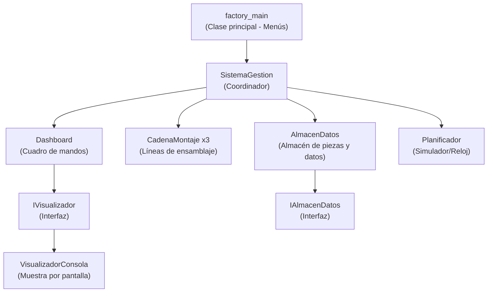
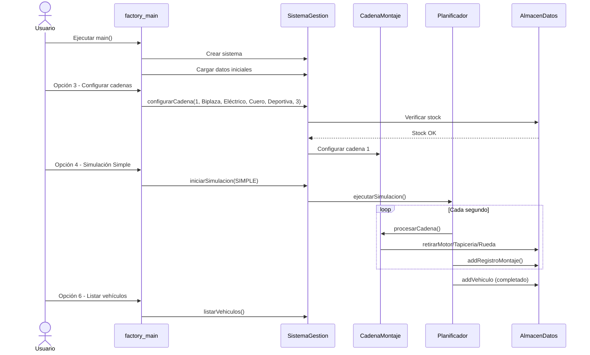

# 📖 Guía Completa - Sistema de Gestión de Fábrica de Vehículos

## 🎯 ¿Qué hace este programa?

Simula una **fábrica de coches** donde se ensamblan vehículos en cadenas de montaje. El programa permite:
- Gestionar un almacén de piezas (motores, tapicerías, ruedas)
- Dar de alta trabajadores (operarios, mecánicos, gestores, admin)
- Configurar 3 cadenas de montaje para producir vehículos
- Simular el proceso de ensamblaje segundo a segundo
- Ver un dashboard con el estado de todo el sistema

---

## 🏗️ Arquitectura General



> [!IMPORTANT]
> La clave del diseño son las **interfaces** `IAlmacenDatos` e `IVisualizador`. Permiten cambiar el almacén o la visualización sin tocar el resto del código. Esto es lo que pide el enunciado como "diseño desacoplado".

---

## 📁 Explicación de cada archivo

### 1. Enumeraciones (Enums)

#### `EstadoVehiculo.java`
Define los **estados** por los que pasa un vehículo durante el montaje:
```
PENDIENTE → CHASIS → MOTOR → TAPICERIA → RUEDAS → COMPLETADO
```
Tiene un método `siguiente()` que devuelve el siguiente estado en la cadena. Así el vehículo va avanzando automáticamente.

#### `TipoSimulacion.java`
Define los 3 modos de simulación: `SIMPLE`, `COMPLEJA`, `MUY_COMPLEJA`. Cada uno tiene su texto descriptivo.

---

### 2. Interfaces (Contratos de diseño)

#### `IAlmacenDatos.java`
Es un **contrato** que dice: "cualquier almacén debe tener estos métodos":
- Añadir/retirar motores, tapicerías, ruedas
- Añadir/buscar/eliminar trabajadores
- Añadir/consultar vehículos completados
- Guardar/consultar registros de montaje

> [!TIP]
> ¿Por qué una interfaz? Si mañana quieres guardar datos en un fichero en vez de en memoria, creas una clase `AlmacenFichero implements IAlmacenDatos` y cambias UNA línea en `SistemaGestion`. El resto del programa no se toca.

#### `IVisualizador.java`
Contrato para mostrar información. Métodos como:
- `mostrarEstadoCadenas()` - muestra el estado de las 3 cadenas
- `mostrarEstadoAlmacen()` - muestra stock de piezas
- `mostrarDashboard()` - muestra todo junto
- `mostrarMensaje()` / `mostrarError()`

---

### 3. Clases Abstractas (Las "plantillas")

#### `Motor.java` (abstracta)
Propiedades comunes a todo motor:
- `cilindrada` (cc), `potencia` (CV), `numCilindros`
- Método abstracto `getTipo()` → cada subclase dice qué tipo es

#### `Tapiceria.java` (abstracta)
- `color`, `metrosCuadrados`
- Método abstracto `getTipo()`

#### `Rueda.java` (abstracta)
- `anchoMm`, `diametroLlantaPulgadas`, `indiceCargaKg`, `codigoVelocidadKmh`
- Método abstracto `getTipo()`

#### `Vehiculo.java` (abstracta)
La más importante. Un vehículo tiene:
- **Propiedades**: `color`, `numPlazas`, `tara`, `pesoMaxAutorizado`
- **Componentes**: un `Motor`, una `Tapiceria`, un array de 4 `Rueda`
- **Estado**: `EstadoVehiculo` (por dónde va en la cadena de montaje)
- **ID automático**: cada vehículo creado tiene un ID único (contador estático)
- Método `avanzarEstado()` que lo mueve al siguiente paso

#### `Trabajador.java` (abstracta)
Datos personales de cualquier trabajador:
- `nombre`, `apellidos`, `dni`, `direccion`, `numSeguridadSocial`, `puesto`, `salario`, `fechaIngreso`
- Método abstracto `getPerfil()` → cada tipo dice qué perfil es

---

### 4. Subclases Concretas

#### Motores
| Clase | getTipo() | Particularidad |
|-------|-----------|----------------|
| `MotorElectrico` | "Eléctrico" | Cilindrada=0, cilindros=0 (solo potencia) |
| `MotorGasolina` | "Gasolina" | Tiene cilindrada, potencia y cilindros |
| `MotorHibrido` | "Híbrido" | Igual que gasolina (combina ambos) |

#### Tapicerías
| Clase | getTipo() |
|-------|-----------|
| `TapiceriaTela` | "Tela" |
| `TapiceriaCuero` | "Cuero" |
| `TapiceriaAlcantara` | "Alcántara" |

#### Ruedas
| Clase | getTipo() |
|-------|-----------|
| `RuedaNormal` | "Normal" |
| `RuedaDeportiva` | "Deportiva" |
| `RuedaTodoterreno` | "Todoterreno" |

#### Vehículos
| Clase | getTipo() | Plazas |
|-------|-----------|--------|
| `BiplazaDeportivo` | "Biplaza Deportivo" | Siempre 2 (fijo) |
| `Turismo` | "Turismo" | Configurable (normalmente 5) |
| `Furgoneta` | "Furgoneta" | Configurable (normalmente 3) |

#### Trabajadores

| Clase | getPerfil() | Función especial |
|-------|-------------|------------------|
| `Operario` | "Operario Eficiente" o "Operario Estándar" | Controla robots de montaje |
| `GestorPlanta` | "Gestor de Planta" | Configura cadenas, vigila dashboard |
| `AdministradorSistema` | "Administrador del Sistema" | Restaura el sistema tras caídas |
| `MecanicoCinta` | "Mecánico Eficiente" o "Mecánico Estándar" | Repara cintas averiadas |

> [!NOTE]
> **Operario**: empieza como "estándar" (tarda 3 segundos). Cuando supera 10 montajes, se convierte automáticamente en "eficiente" (tarda 1 segundo). El perfil es **dinámico**, se calcula con `isEficiente()` que mira `montajesRealizados > 10`.
>
> **Mecánico**: igual, empieza "estándar" (2-5 segundos aleatorios). Con más de 20 reparaciones pasa a "eficiente" (1 segundo).

---

### 5. Clases del Sistema

#### `AlmacenDatos.java`
Implementa `IAlmacenDatos`. Guarda **todo en memoria** usando `ArrayList`:
- `ArrayList<Motor>` → stock de motores
- `ArrayList<Tapiceria>` → stock de tapicerías
- `ArrayList<Rueda>` → stock de ruedas
- `ArrayList<Vehiculo>` → vehículos terminados
- `ArrayList<Trabajador>` → todos los empleados
- `ArrayList<RegistroMontaje>` → historial de montajes

Métodos útiles:
- `retirarMotor("Gasolina")` → saca un motor gasolina del stock y lo devuelve
- `contarMotoresPorTipo("Eléctrico")` → cuenta cuántos eléctricos hay
- `buscarTrabajadores("García")` → busca por nombre/apellidos/DNI
- `getOperarios()` → filtra solo los operarios de la lista de trabajadores

#### `CadenaMontaje.java`
Cada cadena tiene:
- **Número** (1, 2 o 3)
- **Configuración**: qué tipo de vehículo/motor/tapicería/rueda produce
- **Estado**: activa, averiada, tiempo de parada
- **4 operarios** (uno por estación: chasis, motor, tapicería, ruedas)
- **Vehículo en curso**: el que se está ensamblando ahora
- **Contadores**: unidades pendientes y completadas

El flujo es:
```
Configurar → Crear vehículo → Montar chasis → Montar motor → 
Montar tapicería → Montar ruedas → ¡Completado! → Siguiente vehículo...
```

#### `Dashboard.java`
Conecta los datos con la visualización. Usa un `IVisualizador` internamente:
- `actualizar()` → muestra dashboard completo (cadenas + almacén)
- `setVisualizador(nuevo)` → permite cambiar cómo se muestra la info

#### `VisualizadorConsola.java`
Implementa `IVisualizador`. Muestra todo por `System.out.println()` con formato bonito (bordes, separadores, iconos).

#### `RegistroMontaje.java`
Registro de cada acción en las cadenas. Guarda:
- `fecha`, `segundo`, `numeroCadena`, `componente`, `descripcion`, `vehiculoId`
- Permite consultar qué pasó en cada momento

#### `Planificador.java` ⭐ (La más compleja)

Es el **corazón** de la simulación. Funciona como un reloj:

```
Segundo 1 → procesa las 3 cadenas
Segundo 2 → procesa las 3 cadenas
Segundo 3 → procesa las 3 cadenas
... hasta que no quede trabajo pendiente
```

**En cada segundo**, para cada cadena:
1. ¿Está averiada? → decrementar tiempo de parada, no hacer nada
2. ¿No tiene vehículo y hay pendientes? → crear uno nuevo
3. ¿En qué estado está el vehículo? → ejecutar la estación correspondiente
4. ¿Completado? → mover al almacén, empezar otro

**Tres modos de simulación:**

| Modo | Qué pasa |
|------|----------|
| **Simple** | Todo va bien. Los operarios montan sin problemas. Solo varía si son eficientes o estándar. |
| **Compleja** | Se provocan **averías** aleatorias en las cintas. Los mecánicos las reparan. Al menos 2 averías por cadena. |
| **Muy Compleja** | Averías + una **caída de luz** general. El administrador restaura el sistema (2s gestión + 3s cadenas). 2-3 problemas por cadena. |

---

### 6. `SistemaGestion.java`

El **coordinador** central. Conecta todo:
- Crea el almacén, las 3 cadenas, el dashboard y el planificador
- Ofrece métodos para añadir piezas y trabajadores
- Configura cadenas verificando que hay stock suficiente
- Lanza simulaciones
- Genera listados y búsquedas

### 7. `factory_main.java`

La clase que el usuario ejecuta. Tiene:
- **Datos iniciales precargados**: 12 operarios, 1 gestor, 1 admin, 3 mecánicos, stock de piezas
- **Menú principal** con 6 opciones:
  1. Gestión de Almacén (añadir piezas, ver stock)
  2. Gestión de Trabajadores (dar de alta, buscar, listar)
  3. Configurar Cadenas de Montaje
  4. Iniciar Simulación (Simple/Compleja/Muy Compleja)
  5. Dashboard (ver estado actual)
  6. Consultas y Listados (operarios por productividad, vehículos por componente, registros por fecha)

---

## 🔄 Flujo Completo de Uso



---

## 🧩 Conceptos POO Utilizados

| Concepto | Dónde se ve |
|----------|-------------|
| **Abstracción** | Clases abstractas: `Vehiculo`, `Motor`, `Tapiceria`, `Rueda`, `Trabajador` |
| **Encapsulamiento** | Todas las variables son `private` con getters/setters públicos |
| **Herencia** | `BiplazaDeportivo extends Vehiculo`, `MotorElectrico extends Motor`, etc. |
| **Polimorfismo** | `ArrayList<Trabajador>` puede contener Operarios, Mecánicos, etc. Se llama a `getPerfil()` y cada uno devuelve su perfil |
| **Interfaces** | `IAlmacenDatos`, `IVisualizador` para desacoplar componentes |
| **Método abstracto** | `getTipo()` en Motor/Tapiceria/Rueda, `getPerfil()` en Trabajador |
| **Variables estáticas** | Contador de IDs en `Vehiculo`, constantes de tiempo en `AdministradorSistema` |
| **Enumeraciones** | `EstadoVehiculo`, `TipoSimulacion` |

---

## 📋 Datos Precargados al Iniciar

- **12 operarios** con diferentes nombres y fechas de ingreso
- **1 gestor de planta** (Roberto Hernández)
- **1 administrador del sistema** (Isabel Jiménez)
- **3 mecánicos** de cinta
- **10 motores eléctricos**, 15 gasolina, 10 híbridos
- **15 tapicerías tela**, 10 cuero, 10 alcántara
- **20 ruedas normales**, 15 deportivas, 15 todoterreno
