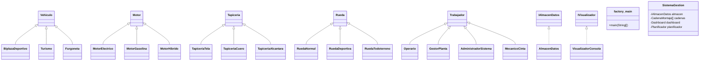

# Sistema de Gestión de Fábrica de Vehículos - BlueJ

## ✅ Estado: Compilado y listo para usar

## Estructura de Clases (33 archivos Java)

### Jerarquía de Clases

### Archivos Creados

| Categoría | Clases | Descripción |
|-----------|--------|-------------|
| **Enums** | `EstadoVehiculo`, `TipoSimulacion` | Estados de montaje y tipos de simulación |
| **Interfaces** | `IAlmacenDatos`, `IVisualizador` | Desacoplamiento de almacén y visualización |
| **Vehículos** | `Vehiculo` (abstract), `BiplazaDeportivo`, `Turismo`, `Furgoneta` | Jerarquía de vehículos |
| **Motores** | `Motor` (abstract), `MotorElectrico`, `MotorGasolina`, `MotorHibrido` | Jerarquía de motores |
| **Tapicería** | `Tapiceria` (abstract), `TapiceriaTela`, `TapiceriaCuero`, `TapiceriaAlcantara` | Jerarquía de tapicerías |
| **Ruedas** | `Rueda` (abstract), `RuedaNormal`, `RuedaDeportiva`, `RuedaTodoterreno` | Jerarquía de ruedas |
| **Trabajadores** | `Trabajador` (abstract), `Operario`, `GestorPlanta`, `AdministradorSistema`, `MecanicoCinta` | Jerarquía de trabajadores |
| **Sistema** | `AlmacenDatos`, `CadenaMontaje`, `Dashboard`, `Planificador`, `SistemaGestion`, `VisualizadorConsola`, `RegistroMontaje` | Clases del sistema |
| **Principal** | `factory_main` | Clase principal con interfaz textual |

### Niveles Implementados

- **Nivel 1** ✅ - Diseño OOP completo con herencia, abstracción, encapsulamiento y polimorfismo
- **Nivel 2** ✅ - Gestión de almacén, trabajadores, simulación Simple, búsquedas
- **Nivel 3** ✅ - Interfaz textual, planificador completo (Simple/Compleja/Muy Compleja), dashboard, listados con filtrado y ordenación

### Cómo Abrir en BlueJ

1. Abrir BlueJ
2. **Project > Open Project** 
3. Navegar a `C:\Users\madisa\Desktop\uned\practica objetos`
4. Se abrirá con el diagrama de clases
5. Click derecho en `factory_main` > `void main(String[])` para ejecutar

### Patrones de Diseño Utilizados

- **Herencia**: Todas las jerarquías (Vehiculo, Motor, Tapiceria, Rueda, Trabajador)
- **Abstracción**: Clases abstractas con métodos abstractos (`getTipo()`, `getPerfil()`)
- **Encapsulamiento**: Variables privadas con getters/setters
- **Polimorfismo**: Uso de tipos abstractos en colecciones y parámetros
- **Interfaces**: `IAlmacenDatos` e `IVisualizador` para desacoplamiento
- **Strategy Pattern**: Visualizador intercambiable en el Dashboard
